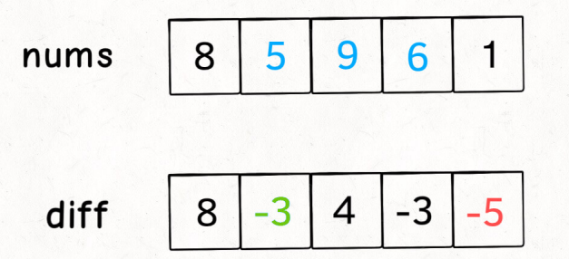
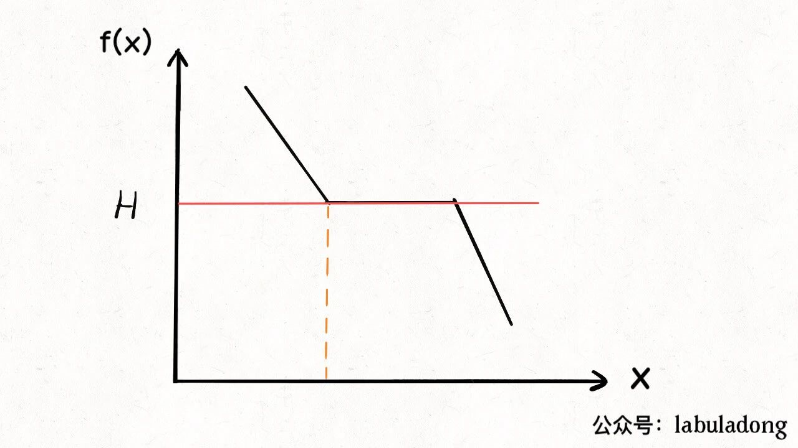
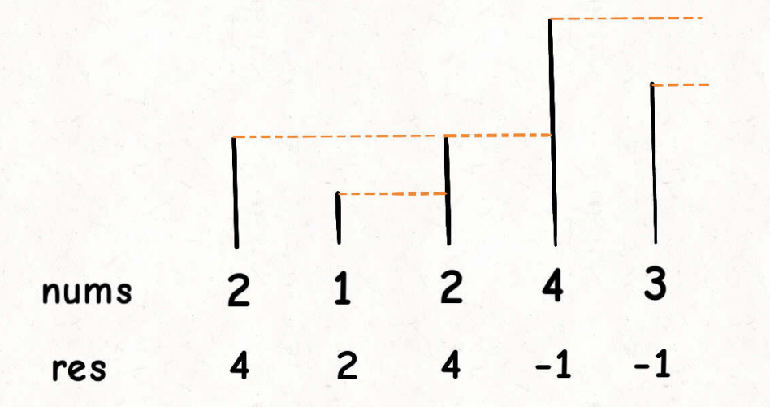
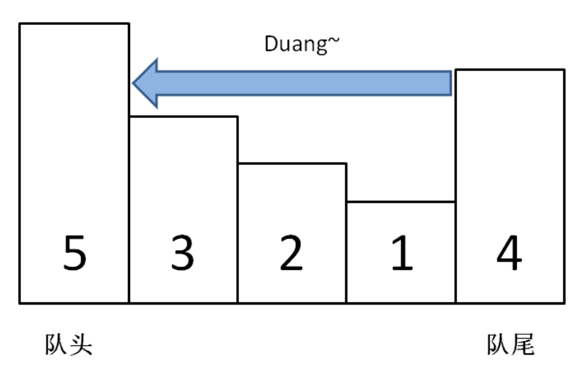

1. 数组和链表代表着计算机最基本的两种存储形式：顺序存储和链式存储，所以他们两个可以算是最基本的数据结构了。

   数组和链表的主要算法技巧是双指针，双指针又分为中间向两端扩散的双指针，两端向中间收缩的双指针，以及快慢指针，除了双指针之外，前缀和和差分数组也是常用技巧

2. 前缀和技巧**适用于原始数组不会被修改的情况下**，快速、频繁地计算/查询一个索引区间内的元素之和

   ```java
   // 前缀和的核心代码
   class prefixSum {
       private int[] prefix;
       
       public prefixSum(int[] nums) {
           prefix = new int[nums.length + 1];
           // 计算nums的累加和
           for (int i = 1; i < prefix.length; i++) {
               prefix[i] = prefix[i - 1] + nums[i - 1];
           }
       }
       
       // 查询区间[i,j]的累加和
       public int query(int i, int j) {
           return prefix[j + 1] - prefix[i];
       }
   }
   ```

   

3. 差分数组是和前缀和思想很相似的一个算法技巧，**差分数组的主要适用场景是频繁对原始数组某个区间的元素进行增减**

   差分数组`diff`表示的是一个数和他前一个数的差值

   

   ```java
   // 差分数组的核心代码
   class Difference {
       // 差分数组表示第i个数和第i-1个数之和
       private int[] diff;
       
       public Difference(int[] nums) {
           diff = new int[nums.length];
           diff[0] = nums[0];
           // 根据初始数组构造差分数组
           for (int i = 1; i < nums.length; i++) {
               diff[i] = nums[i] - nums[i - 1];
           }
       }
       
       // 给区间[i,j]增加val（val可以是负数）
       public void increment(int i, int j, int val) {
           diff[i] += val;
           if (j + 1 < diff.length) {
               diff[j + 1] -= val;
           }
       }
       
       // 根据差分数组，还原原数组
       public int[] result() {
           int[] res = new int[diff.length];
           res[0] = diff[0];
           for (int i = 1; i < diff.length; i++) {
               res[i] = res[i - 1] + diff[i];
           }
           return res;
       }
   }
   ```

   

   

4. 对于子串、子数组的问题，很有可能使用滑动窗口能够解决，滑动窗口的框架

   ```java
   public void slidingWindow(String s, String t) {   // t是子数组
       HashMap<Character, Integer> need = new HashMap<>();
       HashMap<Character, Integer> window = new HashMap<>();
       int left = 0, right = 0;
       int valid = 0;
       
       while (right < s.length()) {
           // c是移入窗口的字符
           char c = s.charAt(right);
           // 右移窗口
           right++;    
           // 从上面两行代码可以看出区间是左开右闭的[left,right)
           
           // 对窗口内的数据进行更新
           ...
               
           while (window needs shrink) {   // 窗口能够收缩的条件
               // d是移出窗口的字符
               char d = s.charAt(left);
               // 收缩窗口
               left++;
               // 对窗口内数据进行更新
               ...
           }    
       }
   }
   ```


5. 有一个小点需要注意，在Java中，Integer等包装类的类型判断相等不能够直接使用`==`，应该和String一样，也使用`equals()`

   

6. 二分搜索的基本框架

   ```java
   // 最简单的二分查找，在一个排序数组中找某个数，默认是升序
   int binarySearch(int[] nums, int target) {
       int left = 0;
       int right = nums.length - 1;
       // left到right是一个闭区间,，所以while里面是小于等于号，当left = right + 1的时候跳出循环
       while (left <= right) {
           int mid = left + (right - left) / 2;
           if (nums[mid] == target) {
               return mid;
           } else if (nums[mid] < target) {
               left = mid + 1;
           } else {
               right = mid - 1;
           }
       }
       return -1;
   }
   
   
   // 但是如果数组是[1,2,3,3,3,3,4,5,6]，我想要查找3的左边界或者右边界
   int leftBound(int[] nums, int target) {
       int left = 0;
       int right = nums.length - 1;
       while (left <= right) {
           int mid = left + (right - left) / 2;
           if (nums[mid] == target) {
               right = mid - 1;      // 因为是找左边界，所以收缩右边
           } else if (nums[mid] < target) {
               left = mid + 1;
           } else {
               right = mid - 1;
           }
       }
       // 出来的时候需要判断一下left是不是越界了
       // 当target比所有元素大的时候，left会越界
       if (left >= nums.length || nums[left] != target) {
           return -1;
       }
       return left;
   }
   
   // 找右边界
   int rightBound(int[] nums, int target) {
       int left = 0;
       int right = nums.length - 1;
       while (left <= right) {
           int mid = left + (right - left) / 2;
           if (nums[mid] == target) {
               left = mid + 1;
           } else if (nums[mid] < target) {
               left = mid + 1;
           } else {
               right = mid - 1;
           }
       }
       // 当target比所有元素都小的时候，会被减到-1
       if (right < 0 || nums[right] != target) {
           return -1;
       } 
       return right;
   }
   
   // 如果使用左闭右开区间的话，找左边界
   int leftBound(int[] nums, int target) {
       int left = 0;
       int right = nums.length;   // 这里不一样
       while (left < right) {     // 因为是左闭右开，所以这里也就不能够有等号了
           int mid = left + (right - left) / 2;
           if (nums[mid] == target) {
               right = mid;      // 因为是找左边界，所以收缩右边，同时由于右边是开区间，所以没必要在-1了
           } else if (nums[mid] < target) {
               left = mid + 1;
           } else {
               right = mid;
           }
       }
       // 出来的时候需要判断一下left是不是越界了
       // 当target比所有元素大的时候，left会越界
       // if (left >= nums.length || nums[left] != target) {
       //    return -1;
       // }
       // 这种写法下不可能会越界
       return left;
   }
   ```

   上面只是最简单的二分查找，还有一些问题能够使用二分，比如[1011. 在 D 天内送达包裹的能力](https://leetcode-cn.com/problems/capacity-to-ship-packages-within-d-days/comments/)和[875. 爱吃香蕉的珂珂](https://leetcode-cn.com/problems/koko-eating-bananas/comments/)

   我们先来说一下能够使用二分的场景，我们知道对于排序数组中的元素查找问题可以使用二分，我们把这个条件泛化一下，凡是题目中能够抽象出一个自变量和一个单调函数的，都能够使用二分

   

   这类问题的框架是

   ```java
   int f(int[] nums, int x) {
       // x是自变量，nums是题目中提供的数组，如果能够将数组转化成关于x的单调函数，就可以进行二分
       
   }
   
   int binarySearch(int[] nums, int target) {
       if (nums.length == 0) {
           return -1;
       }
       
       // 一定要注意：左右边界根据题目要求来确定，这一步也很重要！！
       
       int left = ...;   // 根据题意，看看自变量的最小值是多少
       int right = ... + 1;  // 根据题意，看看自变量的最大值是多少，别忘了最后加1
       // 这里就使用[left, right)，左闭右开区间，避免后面再去打补丁
       while (left < right) {
           int mid = left + (right - left) / 2;
           if (f(nums, mid) == target) {
               // 上面的两个例题都是去找左边界，看看题目是让找左边界还是右边界
               ...
           } else if (f(nums, mid) < target) {
               // 问自己：怎么让f(x)大一点
               ...
           } else {
               // 怎么让f(x)小一点
               ...
           }
       }
       return left;
   }
   ```

   

7. 田忌赛马问题的核心就是让自己占便宜，让对方吃亏，**打得过就打，打不过就拿自己这边的的垃圾去和对方的精锐换**

   ```java
   // 核心代码
   int n = nums1.length;  
   
   sort(nums1); // 田忌的马
   sort(nums2); // 齐王的马
   
   // 从最快的马开始比
   for (int i = n - 1; i >= 0; i--) {
       if (nums1[i] > nums2[i]) {
           // 田忌的马比齐王的马厉害，比得过跟他比
           // 这里没必要使用节约策略，比如田忌最好的马是T1,第二好的马是T2，齐王最好的马是Q1，如果T1大于Q1，T2也大于Q1
           // 这种情况下，直接使用T1和Q1比了就行，没必要去使用T2，因为T2快于齐王的最好的马了，齐王剩下的马也肯定没有比T2好的         // 了
       } else {
           // 比不过，换一个垃圾的马来
       }
   }
   
   // 真正实现的时候，还会用到双指针
   ```

   > 例题：[870. 优势洗牌](https://leetcode-cn.com/problems/advantage-shuffle/)

8. 在排序问题中，如果不能够直接修改原数组，需要辅助结构，一定要想到大根堆或者小根堆

9. 对于单链表的问题，我们大部分情况下可以使用双指针，快慢指针，还有实在没思路的时候不妨考虑一下递归

10. 使用两个栈能够实现一个队列，使用一个队列能够实现栈

11. 解决“括号题目”可能会使用到栈，因为可能会涉及到左括号和右括号的顺序匹配

12. 单调栈的用途不太广泛，只处理一种典型的问题，叫做`Next Greater Element`，这种问题的意思是：给定一个数组`[2,1,2,4,3]`，求出每个元素后面离他最近且比他大的元素，如下图所示

    

    这就相当于“按照身高排大小”，如果能够看到元素「2」，那么他后面可见的第⼀个人就是「2」的 Next Greater Number，因为比「2」小的元素身高不够，都被「2」挡住了，第⼀个露出来的就是答案。

    ```java
    // 单调栈框架代码
    public int[] findNextGreatNumber(int[] nums) {
        if (nums.length == 0) {
            return new int[0];
        }
        Stack<Integer> stack = new Stack<>();
        int[] res = new int[nums.length];
        // 因为栈是先进后出，所以要倒序处理
        for (int i = nums.length - 1; i >= 0; i--) {
            // 单调栈的顺序是从上往下依次增大，这里必须要有等号
            while (!stack.isEmpty() && stack.peek() <= nums[i]) {
                stack.pop();
            }
            res[i] = stack.isEmpty() ? -1 : stack.peek();
            stack.push(nums[i]);
        }
        return res;
    }
    // 时间复杂度从整体看，每个元素最大进栈一次，出栈一次，没有其他操作，所以总的计算规模和元素规模n成正比，时间复杂度是O(N)
    ```

    

13. 单调队列这个数据结构可以用来解决滑动窗口相关问题，比如leetcode 239，滑动窗口的最大值

    单调队列实现的过程中，时刻想着这幅图就不会出错了

    

    ```java
    // 实现单调队列的时候，脑子里要时刻想着上面这幅图
    class MonotonicQueue{
        LinkedList<Integer> q = new LinkedList<>();
        
        public void push(int n) {
            // duang过程
            while (!q.isEmpty() && q.peekLast() < n) {
                q.pollLast();
            }
            q.addLast();
        }
        
        public int max() {
            return q.getFirst();
        }
        
        public void pop(int n) {
            if (n == q.getFirst()) {
                q.pollFirst();
            }
        }
    }
    ```


> 单调栈是大小个排队，单调队列是胖子压瘦子


14. 原地修改有序数组的时候，能够直接使用双指针

    但是如果不是有序数组的话，我们可以需要使用单调栈了，因为单调栈还能够保证数组数据的相对顺序不改变

    如果没有保证数组相对顺序不变这个条件的话，我们可以直接把数组排序，然后在双指针（快慢指针）来做

    对于不是有序数组的情况，以[leetcode 316. 去除重复字母](https://leetcode-cn.com/problems/remove-duplicate-letters/)为例

    ```java
    // 我们首先去重，保证相对顺序，同时返回最小的字符排列
    Stack<Character> stack = new Stack<>();
    int[] count = new int[256];
    for (int i = 0; i < s.length(); i++) {
        count[s.charAt(i)]++;
    }
    
    for (int i = 0; i < s.length(); i++) {
        char c = s.charAt(i);
        count[c]--;
        if (inStack[c]) {   // 已经在栈中了，就不要再进来了
            continue;
        }
    
        while (!stack.isEmpty() && stack.peek() > c) {
            if (count[c] == 0) {
            	break;
        	}
            inStack[stack.pop()] = false;  // 弹出栈，同时标记成不在栈中
        }
        stack.push(c);
        inStack[c] = true;
    }
    StringBuilder sb = new StringBuilder();
    while (stack.isEmpty()) {
        sb.append(stack.pop());
    }
    return sb.reverse().toString();
    
    // 上述代码在使用测试用例s = "bcac"，按照刚才的算法逻辑，返回的结果是"ac"，而正确答案应该是"bac"
    // 这是因为当a想要进栈的时候会把bc都弹出去，而b只出现了一次
    // 所以我们还需要一个计数器，来判断每个字符在后面是否还会出现，如果还会出现，那么进行弹栈操作
    // 如果不会出现了，就终止弹栈循环，因为还要保证字符之间的相对顺序
    ```

    


## END

