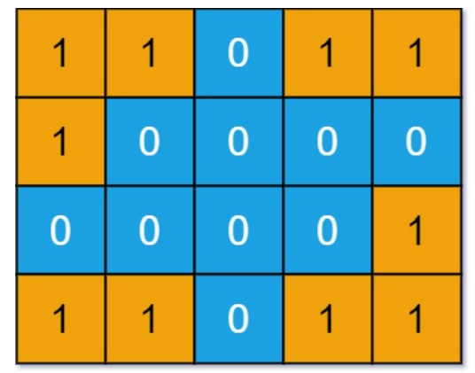

**DFS遍历二维数组的框架**

```java
public void dfs(int[][] grid, int i, int j, boolean[][] visited) {
    int m = grid.length;
    int n = grid[0].length;
    if (i < 0 || j < 0 || i == m || j == n) {
        // 超出了索引边界
        return;
    }
    
    // 如果已经访问过了grid[i][j]这个点
    if (visited[i][j]) {
        return;
    }
    
    // 进入i，j这个点
    visited[i][j] = true;
    
    dfs(grid, i - 1, j, visited);   // 上
    dfs(grid, i + 1, j, visited);   // 下
    dfs(grid, i, j - 1, visited);   // 左
    dfs(grid, i, j + 1, visited);   // 右
}
```


**这些题目中最难的就是`NumberOfDistinctIslands`这道题，因为他还涉及到了岛的形状，也就是序列化**

这里先描述一下题意：

给定一个非空01二维数组表示的网格，一个岛屿由四连通(上、下、左、右四个方向)的1组成，你可以认为网格的四周被海水包围。

请你计算这个网格中共有多少个形状不同的岛屿。两个岛屿被认为是相同的，当且仅当一个岛屿可以通过平移变换(不可以旋转、翻转)和另一个岛屿重合



上图中共有4个岛，但是输出的结果是3，因为左下角和右上角的岛是一样的


很显然，我们要想办法把图中的岛转化，比如变成字符串类型，然后借助HashSet这种数据结构去重，最终得到不同的岛屿的个数

如果想把岛屿转化成字符串，换句话说就是序列化，序列化再进一步就是遍历，我们的dfs框架就已经实现了遍历，而且

```java
    dfs(grid, i - 1, j, visited);   // 上
    dfs(grid, i + 1, j, visited);   // 下
    dfs(grid, i, j - 1, visited);   // 左
    dfs(grid, i, j + 1, visited);   // 右
```

也规定了遍历的顺序。

对于相同的岛屿，他们从同一起点出发遍历出来的形状一定是一样的


我们可以看到，上面的遍历顺序是

> 下，右，上，撤销上，撤销右，撤销下

我们分别通过`1,2,3,4`来代表上下左右，那么上面的遍历顺序就是`2,4,1,-1,-4,-2`

只要每次遍历岛屿的时候都产生这串数字，然后通过这串数字进行比较，就能够知道图中有多少岛屿了
