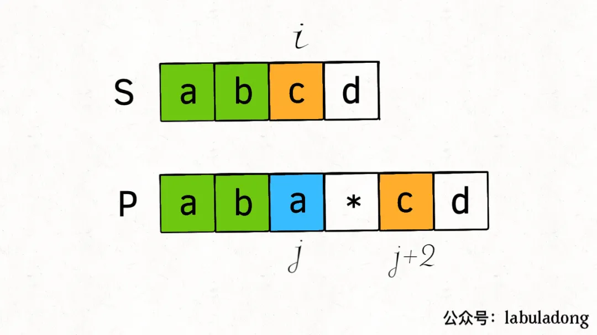
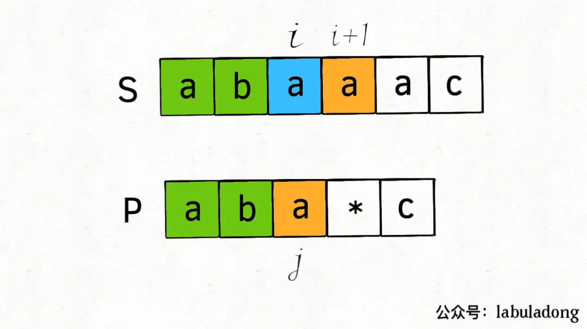
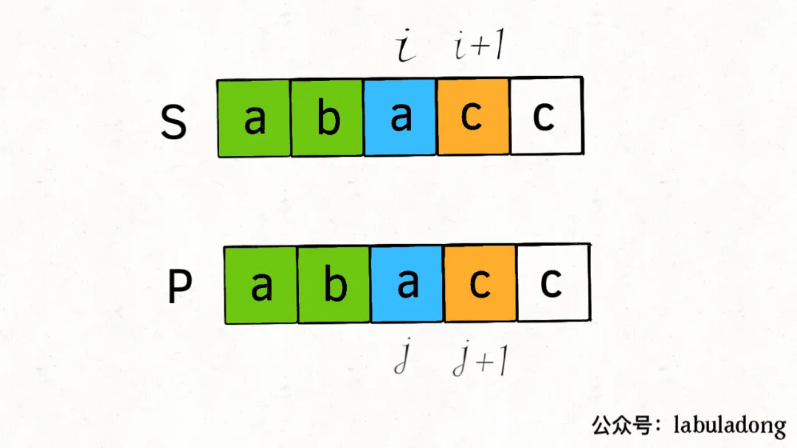
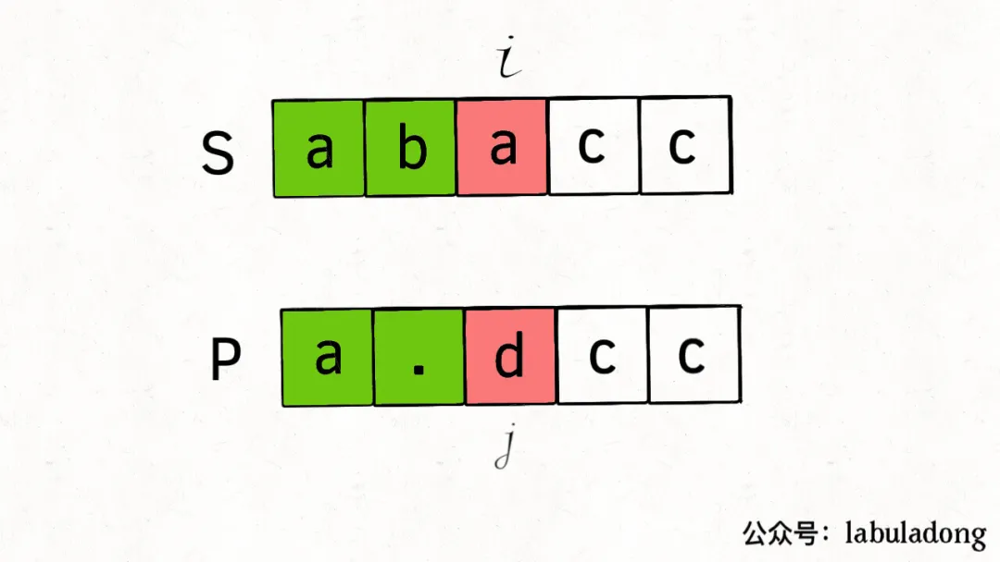

### 正则通配符算法

- 首先，在正则表达式中，`.`可以匹配任意一个字符，`*`可以让他前面的那一个字符重复多次（包括0次）

  > 比如说模式串`".a*b"`就可以匹配文本`"zaaab"`，也可以匹配`"cb"`；模式串`"a..b"`可以匹配文本`"amnb"`；而模式串`".*"`就比较牛逼了，它可以匹配任何文本


对于[正则表达式匹配](https://leetcode-cn.com/problems/regular-expression-matching/)这个题目，其实对于`.`很容易匹配，字符串`s`中的任意字符串只要是碰到了模式串`p`中的`.`都可以通过，比较麻烦的是`*`，因为我们需要判断是匹配0次还是多次，怎么判断是重复0次还是多次，答案就是穷举，两种方案都试试，只要有一种能匹配上就行，所以既然涉及到了两个字符串的穷举了，就应该很自然地想到使用动态规划

**正则表达式算法问题只需要把握住一个基本点：看两个字符是否匹配，一切逻辑围绕匹配/不匹配两种情况展开即可**


```java
// 我们设置一个dp函数
// 表示s(i,..)和p(j,..)能否匹配成功
public boolean dp(String s, int i, String p, int j) 
```

如果不考虑通配符`*`的情况下，则会有如下情况

```java
if (s.charAt(i) == p.charAt(j) || p.charAt(j) == '.') {
    // . 是万金油，s中的任意一个字符他都能匹配上
    i++, j++;  // 去后面继续判断
} else {
    return false;
}
```


如果考虑上通配符`*`，那么情况就会变得复杂了

**当`p[j + 1]`为`*`通配符时，我们分情况讨论下**：

- 如果匹配，即`s[i] == p[j]`，那么有两种情况：
  - `p[j]`有可能会匹配多个字符，比如`s = "aaa", p = "a*"`，那么`p[0]`会通过`*`匹配 3 个字符`"a"`
  - `p[j]`也可能匹配0和字符，比如`s = "aa",  p = "a*aa"`，由于后面的字符可以匹配s，所以`p[0]`只能匹配0次
- 如果不匹配，即即`s[i] != p[j]`，那么此时只有一种情况，那就是匹配0次，把这个字符给跳过去（或者叫删除了，不跟他进行匹配了）
  - `p[j]`只能匹配 0 次，然后看下一个字符是否能和`s[i]`匹配。比如说`s = "aa", p = "b*aa"`，此时`p[0]`只能匹配 0 次


针对上面的分析，可以把代码框架搭建出来了

```java
if (s[i] == p[j] || p[j] == '.') {
    // 匹配
    if (j < p.size() - 1 && p[j + 1] == '*') {
        // 有 * 通配符，可以匹配 0 次或多次
    } else {
        // 无 * 通配符，老老实实匹配 1 次
        i++; j++;
    }
} else {
    // 不匹配
    if (j < p.size() - 1 && p[j + 1] == '*') {
        // 有 * 通配符，只能匹配 0 次
    } else {
        // 无 * 通配符，匹配无法进行下去了
        return false;
    }
}
```

遇到通配符`*`时，匹配0次还是多次，也就是动态规划中的状态和选择，状态无非就是`i`和`j`的位置，而选择就是匹配0次还是多次

对上面这四种情况，分别进行分析

- 在`s[i] == p[j] || p[j] == '.'`的情况下，有`p[j + 1] = *`通配符，匹配0次或者多次

  - 匹配0次，即模式串走两步，`j+2`，`i`不动

  

  

  - 匹配多次，让`i`往后移动，`j`不动，意思就是`p[j]`能够继续匹配

    

  

- 在`s[i] == p[j] || p[j] == '.'`的情况下，有`p[j + 1] != *`通配符，这时候只能是`i++,j++`了

  

- 在`s[i] != p[j] && p[j] != '.'`的情况下，如果有`p[j + 1] == *`通配符，这时候只能是匹配0次，表示把`p[j]`这个字符给越过去

  

- 在`s[i] != p[j] && p[j] != '.'`的情况下，且`p[j + 1] != *`，那么只能是直接返回`false`了

  


所以说，上面的代码框架可以补充为

```java
if (s[i] == p[j] || p[j] == '.') {
    // 匹配
    if (j < p.size() - 1 && p[j + 1] == '*') {
        // 有 * 通配符，可以匹配 0 次或多次
        return dp(s, i, p, j + 2) || dp(s, i + 1, p, j);
    } else {
        // 无 * 通配符，老老实实匹配 1 次
        // i++; j++;
        return dp(s, i + 1, p, j + 1);
    }
} else {
    // 不匹配
    if (j < p.size() - 1 && p[j + 1] == '*') {
        // 有 * 通配符，只能匹配 0 次
        return dp(s, i, p, j + 2);
    } else {
        // 无 * 通配符，匹配无法进行下去了
        return false;
    }
}
```


算法的绝大部分框架已经完成了，还剩下一部分，那就是`base case`，这里的base case需要动脑筋

```java
// base case
if (j == p.length()) {
    // 当模式串走到头了，我们只需要看看字符串是否也走到了头
    return i == s.length();
}

if (i == s.length()) {
  //  return j == p.length();   // 这样写是不对的，因为如果字符串已经走完了，而模式串还没有走完，仍然是可能能匹配的，比如
    							// s = "as"  p = "asb*c*d*e*"，这样也是能够匹配的
    // 所以我们要判断一下，当s走到头之后，p剩下的这些字符串是不是`一个字符一个*`这种模式的
    if ((p.length() - j) % 2 == 1) {
        return false;   // 奇数的情况下，肯定不是这种模式
    } 
    for (; j + 1 < p.length(); j += 2) {
        if (p.charAt(j + 1) != '*') {
            return false;
        }
    }
    return true;
}
```

