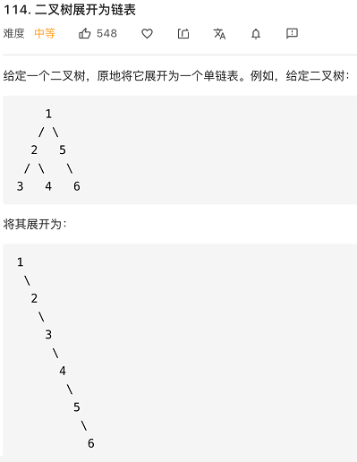
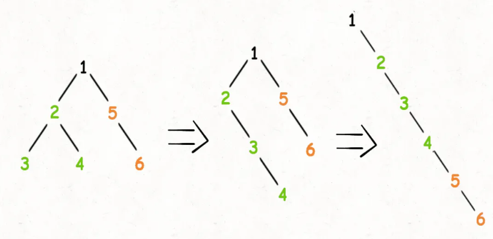
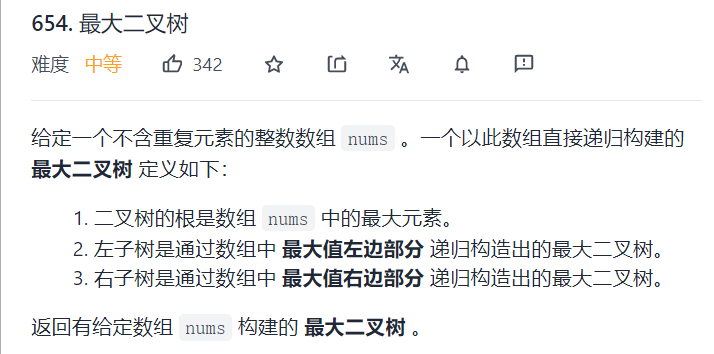
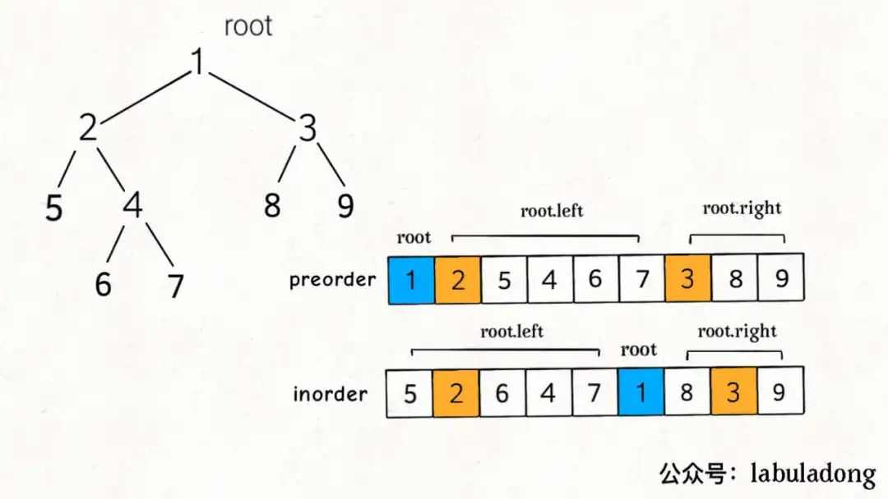
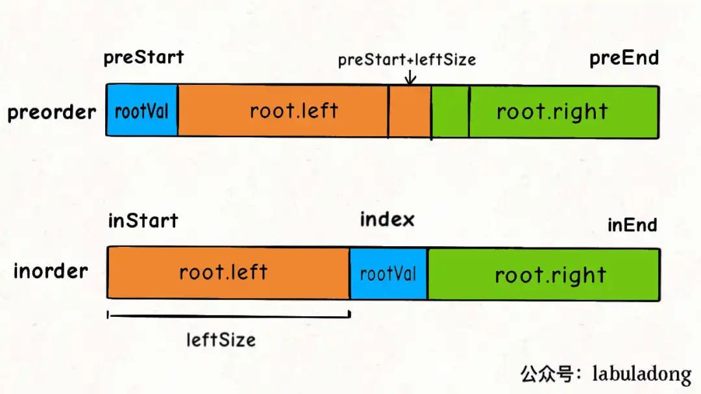
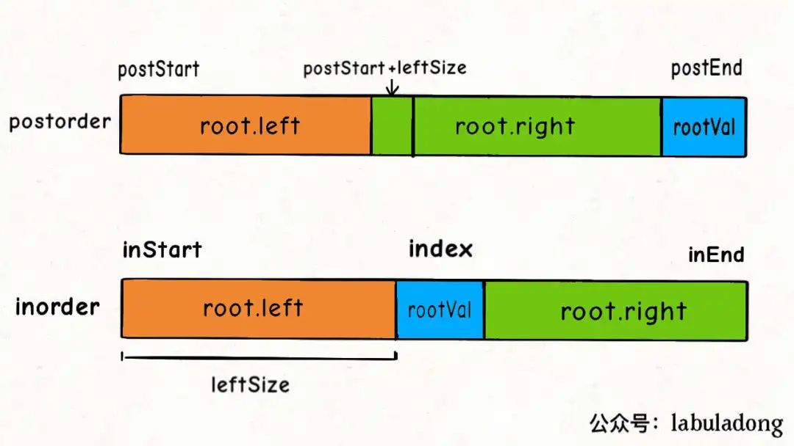
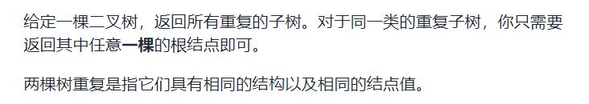
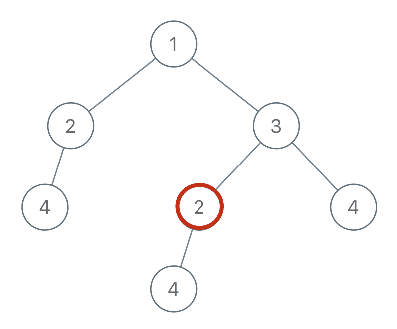
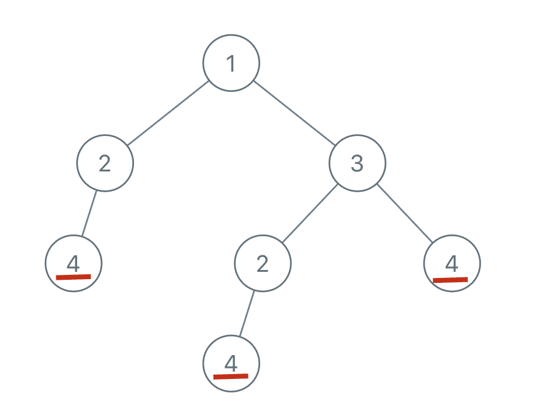

**<font color=red size=4pt>来自labuladong公众号</font>**

首先，需要，明确的一点是，**树的问题永远离不开树的递归遍历这几行代码**

```java
void traverse(TreeNode root) {
    // 前序遍历
    traverse(root.left);
    // 中序遍历
    traverse(root.right);
    // 后序遍历
}
```


> <font color=blue>为什么数的递归算法这么重要，原因肯定是因为它的应用特别广泛</font>

本质上，快速排序和归并排序也可以看成是树的遍历，快速排序是前序遍历，归并排序是后序遍历

- 首先我们先来看一下快速排序，快速排序的思想是：如果我们想要对`arr[left,...,right]`进行排序，我们先要选出一个分界点`p`，通过交换元素使得`arr[left,...,p-1]`都小于等于`arr[p]`，`arr[p+1,...,right]`都大于等于`arr[p]`，然后递归地去`arr[left,...,p-1]`和`arr[p+1,...,right]`中寻找新的分界点，最后整个数组就都被排序了

  所以，快排的代码框架可以被写成

  ```java
  void sort(int[] arr, int left, int right) {
      int p = partition(arr, left, right);
      sort(arr,left, p - 1);
      sort(arr, p + 1, right);
  }
  // 先构造分界点，然后去左右子数组构造分界点，很明显这是前序遍历的框架
  ```

- 然后我们再来看一下归并排序，归并排序的思想是：：如果我们想要对`arr[left,...,right]`进行排序，我们先要对`arr[left,...mid]`进行排序，然后再对`arr[mid+1,...,right]`进行排序，最后把这两个有序的子数组再进行合并，整个数组就排好序了

  ```java
  void sort(int[] arr, int left, int right) {
      int mid = (left + right) >> 1;
      sort(arr, left, mid);
      sort(arr, mid + 1, right);
      merge(arr, left, mid, right);
  }
  ```


### 要点一：明确函数的定义，并相信它！

**写递归函数的关键点就在于要先明确函数的定义是什么，<font color=red>也就是这个函数的功能是什么，他能够干什么</font>，然后相信这个定义，利用这个定义推导出最终结果，绝不要试图跳入这个递归中**

同时，二叉树题目的一个难点在于**如何把题目要求细化成每个节点需要做的事情**

- 比如这个题目，`leetcode 226 反转二叉树 simple`

  ```java
  TreeNode invertTree(TreeNode root) {
      if (root == null) {
          return null;
      }
      TreeNode temp = root.left;
      root.left = root.right;
      root.right = temp;
      
      invertTree(root.left);
      invertTree(root.right);
  }
  /**
   * 这个invertTree函数可以看成是把以node为根节点的树进行翻转，
   * 对于每一个节点，需要做的事情就是把他的左子树和右子树交换即可
   */
  ```


- 又比如另一个题目，将`leetcode 114 二叉树展开为链表 middle`

  

  对于这个题，函数的定义是`void flatten(TreeNode root)`

  那么我们不妨尝试给这个`flatten`函数一个定义，**它的作用是把以`root`为根节点的二叉树给拉平为一个链表**

  那么如何把一棵树给拉成一个链表呢？可以分成下面的两步：

  - 把这个树的左子树给拉成链表，把这个树的右子树给拉成链表
  - 把root的右子树接到左子树下面，然后把root的左子树当作右子树

  

  所以可以根据上面的两步，写出代码：

  ```java
  void flatten(TreeNode root) {
      if (root == null) {
          return;
      }
      
      flatten(root.left);
      flatten(root.right);
      
      TreeNode leftNode = root.left;
      TreeNode rightNode = root.right;
      
      root.left = null;
      root.right = leftNode;
      
      TreeNode cur = root;   
      while(cur.right != null) {
          cur = cur.right;
      }
      cur.right = rightNode;
  }
  // 很明显这是一个后序遍历框架，因为只有当左右子树都被拉平之后，才能进行后面的操作
  ```

  这就是递归的魅力，你说`flatten`函数是怎么把左右子树拉平的？不容易说清楚，**但是只要知道`flatten`的定义如此，相信这个定义，让`root`做它该做的事情，然后`flatten`函数就会按照定义工作。**


### 要点二：细化题目要求，搞清楚根节点应该怎么做，然后剩下的交给前序/中序/后序遍历框架

- 比如`leetcode 654 最大二叉树 middle`

  

  函数定义为`TreeNode constructMaximumBinaryTree(int[] nums)`

  - 首先，我们不妨设这个函数的定义就是通过`nums`数组构建出一棵最大二叉树

  - 第二，通过题意我们发现，我们需要先找到根节点在数组中的位置，找到了这个位置之后，左子树和右子树的位置也找到了

    ```java
    public TreeNode constructMaximumBinaryTree(int[] nums) {
        return process(nums, 0, nums.length - 1);
    }
    
    public TreeNode process(int[] nums, int lo, int hi) {
        if (lo > hi) {
            return null;
        }
        // 找到最大值
        int max = Integer.MIN_VALUE;
        int flag = -1;
        for (int i = lo; i <= hi; i++) {
            if (nums[i] > max) {
                flag = i;
                max = nums[i];
            }
        }
    
        TreeNode root = new TreeNode(max);
    
        root.left = process(nums, lo, flag - 1);
        root.right = process(nums, flag + 1, hi);
    
        return root;
    }
    ```

  

- 接下来我们来看两道经典的题目，如何根据前序和中序，后序和中序还原出一根二叉树

  `leetcode 105 从前序遍历和中序遍历中构造二叉树 middle`

  我们知道，前序遍历和中序遍历有以下的特点

  

  找到根节点是很简单的，前序遍历的第一个值`preorder[0]`就是根节点的值，关键在于如何通过根节点的值，将`preorder`和`inorder`数组划分成两半，构造根节点的左右子树？

  ```java
  /* 主函数 */
  TreeNode buildTree(int[] preorder, int[] inorder) {
      return build(preorder, 0, preorder.length - 1,
                   inorder, 0, inorder.length - 1);
  }
  
  /* 
     若前序遍历数组为 preorder[preStart..preEnd]，
     后续遍历数组为 postorder[postStart..postEnd]，
     构造二叉树，返回该二叉树的根节点 
  */
  TreeNode build(int[] preorder, int preStart, int preEnd, 
                 int[] inorder, int inStart, int inEnd) {
      // root 节点对应的值就是前序遍历数组的第一个元素
      int rootVal = preorder[preStart];
      // rootVal 在中序遍历数组中的索引
      int index = 0;
      for (int i = inStart; i <= inEnd; i++) {
          if (inorder[i] == rootVal) {
              index = i;
              break;
          }
      }
  
      TreeNode root = new TreeNode(rootVal);
      // 递归构造左右子树
      root.left = build(preorder, ?, ?,
                        inorder, ?, ?);
  
      root.right = build(preorder, ?, ?,
                         inorder, ?, ?);
      return root;
  }
  ```

  

  根据上面这张图就能够得到?处应该填什么了？

  完整代码如下：

  ```java
  class Solution {
       HashMap<Integer, Integer> hm;
      public TreeNode buildTree(int[] preorder, int[] inorder) {
          hm = new HashMap<>();
          int index = 0;
          for (int num : inorder) {    // 使用哈希表能够通过空间代价省出一点时间
              hm.put(num, index++);
          }
          return buildTreeHelper(preorder, 0, preorder.length - 1, inorder, 0, inorder.length - 1);
      }
  
      public TreeNode buildTreeHelper(int[] preorder, int preStart, int preEnd, int[] inorder,int inStart, int inEnd) {
          if (preStart > preEnd) {
              return null;
          }
          int rootVal = preorder[preStart];
          TreeNode root = new TreeNode(rootVal);
          int position = hm.get(rootVal);   // 找到在inorder中的位置
          int leftSize = position - inStart;
          root.left = buildTreeHelper(preorder,preStart + 1, preStart + leftSize, inorder, inStart, position - 1);
          root.right = buildTreeHelper(preorder, preStart + leftSize + 1, preEnd, inorder, position + 1, inEnd);
          return root;
      }
  }
  ```


- 同理`leetcode 106，通过后序遍历和中序遍历得到二叉树  middle`

  

  ```java
  class Solution {
      HashMap<Integer, Integer> hm;
      public TreeNode buildTree(int[] inorder, int[] postorder) {
          hm = new HashMap<>();
          int i = 0;
          for (int num : inorder) {
              hm.put(num, i++);
          }
          return buildTreeHelper(inorder, 0, inorder.length - 1, postorder, 0, postorder.length - 1);
      }
  
      public TreeNode buildTreeHelper(int[] inorder, int inS, int inE, int[] postorder, int pS, int pE) {
          if (inS > inE) {
              return null;
          }
          int rootVal = postorder[pE];
          TreeNode root = new TreeNode(rootVal);
          int position = hm.get(rootVal);
          int leftSize = position - inS;
          root.left = buildTreeHelper(inorder, inS, position - 1, postorder, pS, pS + leftSize - 1);
          root.right = buildTreeHelper(inorder, position + 1, inE, postorder, pS + leftSize, pE - 1); 
          // pE - 1是把根节点给踢出去
          return root;
      }
  }
  ```


### 要点三：考察一个节点需要干什么，就能够知道使用前序/中序/后序

`leetcode 652 寻找重复的子树 middle`



首先，我们思考做出这道题，对于一个节点它需要做什么事情呢？



比如我现在在2这个节点上了，如果我先要知道以2为根节点的子树是否有重复值，有没有被加入到结果集中，我需要知道什么信息？

- 我需要知道以2为根节点的这颗子树是什么样子
- 然后我需要知道以其他节点为根节点的子树是什么样子

所以，解决了这两个问题就能够把题目做出来了

**首先，解决  以2为根节点的这颗子树是什么样子  这个问题**，我们可以通过序列化的方式来解决

```java
String traverse(TreeNode root) {
    if (root == null) {
        return "#";    // 空节点用#来代替
    }
    String leftTree = traverse(root.left);
    String rightTree = traverse(root.right);
    String subTree = leftTree + "," + rightTree + "," + root.val;
    return subTree;
}
/**
   0             0
  /        与      \     两个子树
 0                  0
中序结果：#0#0#   #0#0#
前序结果：00###   0#0##
后序结果：##0#0   ###00
序列化时只要不是中序，前序或者后序都能通过
*/
```

第二，我们还需要解决 怎么样知道以其他节点为根节点的子树是什么样子的呢？ 很简单，肯定是通过一个额外空间把他们的序列化字符串给存起来，如下代码

```java
HashSet<String> memo = new HashSet<>();    // 记录所有子树

LinkedList<TreeNode> res = new LinkedList<>();   // 记录重复的子树根节点

String traverse(TreeNode root) {
    if (root == null) {
        return "#";    // 空节点用#来代替
    }
    String leftTree = traverse(root.left);
    String rightTree = traverse(root.right);
    String subTree = leftTree + "," + rightTree + "," + root.val;
    if (!memo.contains(subTree)) {
        memo.add(subTree);
    } else {
        res.add(root);
    }
    return subTree;
}
```


通过上面这段代码，就大致上把这道题目完成了，但是还有一个细节，就是`res`可能假如重复的节点，比如



res中就会有两个4节点，这是不符合题意的，所以我们还需要进行一些小改动，可以把HashSet改成HashMap，如下代码：

```java
    public String traverse(TreeNode root) {
        if (root == null) {
            return "#";
        }
        String leftTree = traverse(root.left);
        String rightTree = traverse(root.right);
        String subTree = leftTree + "," + rightTree + "," + root.val;
        int flag = hm.getOrDefault(subTree, 0);
        if (flag == 1) {          // 只有当subTree第二次出现的时候才加入到res中
            res.add(root);
        }
        hm.put(subTree, flag + 1);
        return subTree;
    } 
// 除此之外，String可以换成StringBuilder，能够提高效率
```

