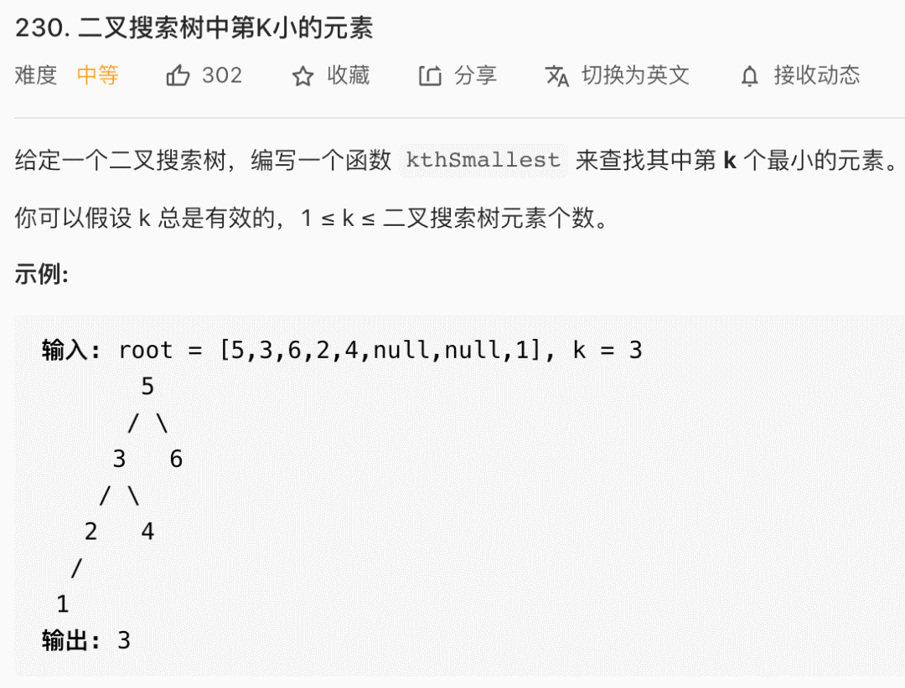
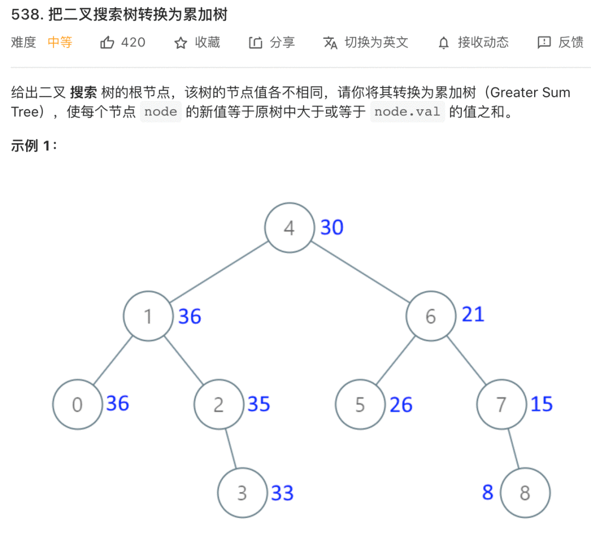
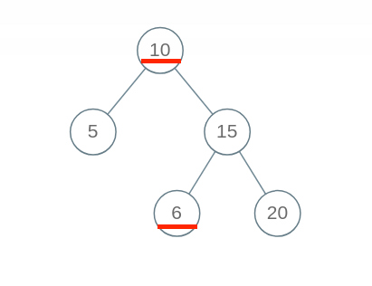
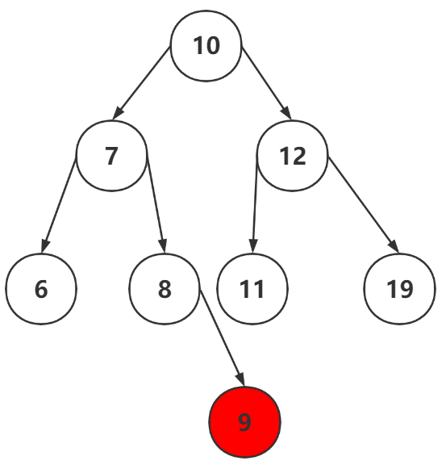
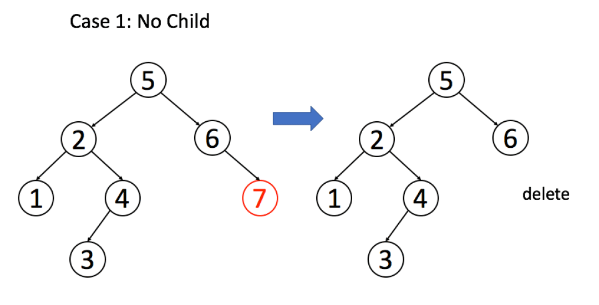
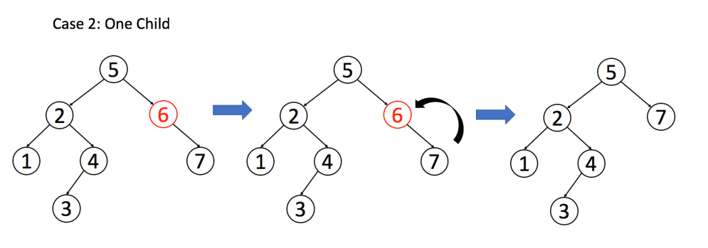
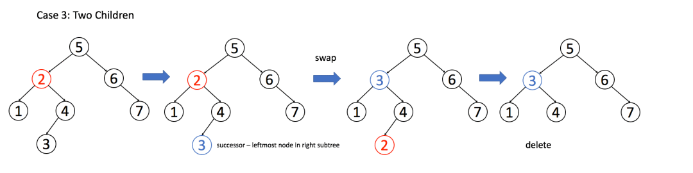
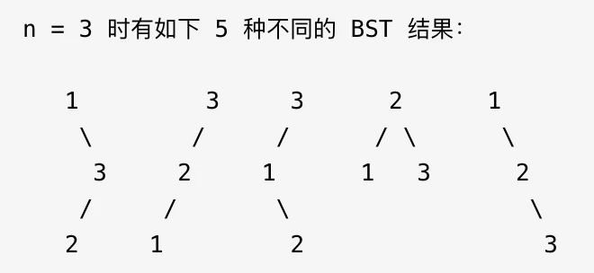

## 利用BST的性质

首先，我们知道BST的性质是：

1、对于 BST 的每一个节点`node`，左子树节点的值都比`node`的值要小，右子树节点的值都比`node`的值大。

2、对于 BST 的每一个节点`node`，它的左侧子树和右侧子树都是 BST

**而且，BST还有一个重要的性质：那就是对二叉搜索树进行中序遍历输出的结果是升序排列的**

```java
void traverse(TreeNode root) {
    if(root == null) return;
    traverse(root.left);
    print(root.val);
    traverse(root.right);
}
// 这样对二叉搜索树进行遍历，打印的结果是升序的

// 如果想要降序打印二叉搜索树的话，只需要先遍历右子树再遍历左子树
void traverse(TreeNode root) {
    if (root == null) return;
    traverse(root.right);
    print(root.val);
    traverse(root.left);
}
```


于是根据搜索二叉树上面的性质就能够做出下面的题目



很明显，上面这道题如果使用搜索二叉树的性质的话，很容易就能够得到答案

```java
class Solution {
    int res = 0;
    int rank = 0;
    public int kthSmallest(TreeNode root, int k) {
        if (root == null) return -1;
        traverse(root, k);
        return res;
    }

    /**
     * 因为中序遍历是按照升序的顺序输出的，所以我们可以在中间判断一下是否到了k，到了的话，把这个值赋给res
     */
    public void traverse(TreeNode root, int k) {
        if (root == null) return;
        traverse(root.left, k);
        rank++;
        if (rank == k) {
            res = root.val;
        }
        traverse(root.right, k);
    }
}
```


例题2：把BST转化成累加树



其实这道题利用搜索二叉树中序遍历的结果是升序很容易得出，我们可以看到比如当前节点是5，那么它的累加和就是5+6+7+8=26，如果我们将遍历顺序取反，那么将会得到从大到小的排序，这时候我们计算出每一个数据的累加和就可以了

```java
class Solution {
    int sum = 0;
    public TreeNode convertBST(TreeNode root) {
        if (root == null) {
            return null;
        }
        convertBST(root.right);
        sum += root.val;
        root.val = sum;
        convertBST(root.left);
        return root;
    }
}
```


## BST的基本操作

BST的基本操作包括：增删查，以及判断BST的合法性

> **<font color=red>首先是判断BST的合法性</font>**

```java
boolean isBST(TreeNode root) {
    if (root == null) return true;
    if (root.left != null && root.val < root.left.val) return false;
    if (root.right != null && root.val > root.right.val) return false;
    return isBST(root.left) && isBST(root.right);
}
```

我们很容易就能够写出上面的代码，当某个节点的左节点的值大于她的时候返回false，或者右节点的值小于她的时候返回false，上面的这个代码看起来很对，但实际上他是错误的，比如这个测试用例



上面这个二叉树不是BST，但是我们的代码会把它判断为true，因为`6 < 15 && 15 < 20`，也就是说他没有对`10和6`进行判断，**出现问题的原因在于，对于每一个节点`root`，代码值检查了它的左右孩子节点是否符合左小右大的原则；但是根据 BST 的定义，`root`的整个左子树都要小于`root.val`，整个右子树都要大于`root.val`**。

那么问题来了，对于每个节点它能够管理的范围只有他自己和它的左右孩子，管不了它的左右子树，那么怎么去把这个节点的值也传给他的左右子树呢？答案是通过增加参数，如下代码

```java
boolean isBST(TreeNode root) {
    return isValidBST(root, null, null);
}

boolean isValidBST(TreeNode root, TreeNode min, TreeNode max) {
    if (root == null) return true;
    if (min != null && root.val < min.val) return false;
    if (max != null && root.val > max.val) return false;
    // 限定左子树的最大值是 root.val，右子树的最小值是 root.val
    return isValidBST(root.left, min, root) && isValidBST(root.right, root, max);
}
```


> **<font color=red>接下来是BST的查找</font>**

如果在BST中查找某个值，那么可以直接使用二分的思想，因为对于任意的一棵BST，左子树一定小于这个节点，右子树一定大于这个节点，代码的框架是

```java
TreeNode find(TreeNode root, int target) {
    if (root == null) return null;
    if (root.val == target) {
        return root;
    } else if (root.val < target) {
        return find(root.right, target);   // 去右子树上找
    } else {
        return find(root.left, target);
    }
}
```

其实通过上面也可以看出，我们可以通过BST的性质（左小右大）来写出一套有关于BST的遍历框架，如下：

```java
void traverseBST(TreeNode root, int target) {
    if (root == null) return;
    if (root.val == target) {
        // do something
    }
    if (root.val > target) {
        tarverseBST(root.left, target);
    }
    if (root.val < target) {
        tarverseBST(root.right, target);
    }
} 
```


> **<font color=red>接下来再来看在BST中插入一个数</font>**



比如说我想要往上图中的BST中插入一个9，我首先需要让9和10比较，知道了他在左子树，然后再和7比较，知道了他在右树，然后再和8比较，知道了他在右树，这时候8的右树为空了，所以直接就可以把9给挂上了

通过上面的过程，我们就可以写出代码了（先找到相应的位置，然后在挂上）

```java
TreeNode insertIntoBST(TreeNode root, int val) {
    if (root == null) return new TreeNode(val);
    if (root.val < val) {
        root.right = insertIntoBST(root.right, val);
    } 
    if (root.val > val) {
        root.left = insertIntoBST(root.left, val);
    }
    return root;
}
```


> **<font color=red>最后来看一下删除BST中的一个数</font>**

首先，需要明确的是，删除一个数也要先找到这个数的位置，在进行删除

其次，删除节点比较复杂，共有三种情况：

- 如果删除节点是叶子节点，在这种情况下直接删除即可

  

  ```java
  if (node.left == null && node.right == null) {
    //   node = null;
      return null;
  }
  ```

  

- 如果删除节点有左节点或者右节点中的一个，那么可以使用这个节点来代替他的位置

  

  ```java
  if (node.left == null) {
      return node.right;
  }
  if (node.right == null) {
      return node.left;
  }
  ```

  

- 如果删除节点左右节点都存在，那么需要找到左子树上最右的节点或者右子树上最左的节点来代替这个位置

  

  ```java
  if (node.left != null && node.right != null) {
      TreeNode replace = getMax(node.left);
      node.val = replace.val;
      node.left = deleteNode(node.left, replace.val);
  }
  ```

  

三种情况整理完毕，那么下面我们将三种情况整理一下，得到

```java
TreeNode deleteNode(TreeNode root, int key) {
    if (root == null) return null;
    if (root.val == key) {
//        if (root.left == null && root.right == null) {
//            return null;
//        }        // 其实下面这两个if把情况一和情况二都包括了
        if (root.left == null) return root.right;
        if (root.right == null) return root.left;
        // 情况三
        TreeNode replace = getMin(root.right);
        root.val = replace.val;
        root.right = deleteNode(root.right, replace.val);   // 从右树中把replace这个点删除
   
    } else if (root.val < key) {
        root.right = deleteNode(root.right, key); 
    } else {
        root.left = deleteNode(root.left, key);
    }
    return root;
}

TreeNode getMin(TreeNode root) {
    while (root.left != null) {
        root = root.left;
    }
    return root;
}
```

删除操作就完成了。注意一下，这个删除操作并不完美，因为我们一般不会通过`root.val = minNode.val`修改节点内部的值来交换节点，而是通过一系列略微复杂的链表操作交换`root`和`minNode`两个节点。

因为具体应用中，`val`域可能会是一个复杂的数据结构，修改起来非常麻烦；而链表操作无非改一改指针，而不会去碰内部数据。

不过这里我们暂时忽略这个细节，旨在突出 BST 基本操作的共性，以及借助框架逐层细化问题的思维方式。


## 计算所有合法的BST




```java
class Solution {
    int[][] dp;       // 通过添加一个备忘录，能减小时间复杂度，去除重叠子问题
    public int numTrees(int n) {
        if (n <= 0) {
            return 0;
        }
        dp = new int[n + 1][n + 1];
        return process(1, n);
    }

    public int process(int left, int right) {
        if (left > right) {
            return 1;   // 注意 base case，显然当lo > hi闭区间[lo, hi]肯定是个空区间，也就对应着空节点 null，虽然是空节点，但是也是一种情况，所以要返回 1 而不能返回 0。
        }
        if (dp[left][right] != 0) {
            return dp[left][right];
        }
        int res = 0;
        for (int i = left; i <= right; i++) {
            int leftNums = process(left, i - 1);
            int rightNums = process(i + 1, right);
            res += leftNums * rightNums;
        }
        dp[left][right] = res;
        return res;
    }
}
```


还有这道题的一个变型，就是把所有合法的BST都保存下来

```java
/* 主函数 */
public List<TreeNode> generateTrees(int n) {
    if (n == 0) return new LinkedList<>();
    // 构造闭区间 [1, n] 组成的 BST 
    return build(1, n);
}

/* 构造闭区间 [lo, hi] 组成的 BST */
List<TreeNode> build(int lo, int hi) {
    List<TreeNode> res = new LinkedList<>();
    // base case
    if (lo > hi) {
        res.add(null);
        return res;
    }

    // 1、穷举 root 节点的所有可能。
    for (int i = lo; i <= hi; i++) {
        // 2、递归构造出左右子树的所有合法 BST。
        List<TreeNode> leftTree = build(lo, i - 1);
        List<TreeNode> rightTree = build(i + 1, hi);
        // 3、给 root 节点穷举所有左右子树的组合。
        for (TreeNode left : leftTree) {
            for (TreeNode right : rightTree) {
                // i 作为根节点 root 的值
                TreeNode root = new TreeNode(i);
                root.left = left;
                root.right = right;
                res.add(root);
            }
        }
    }

    return res;
}
```


