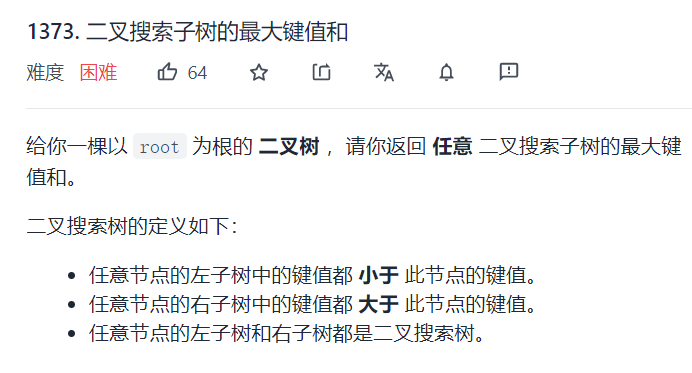
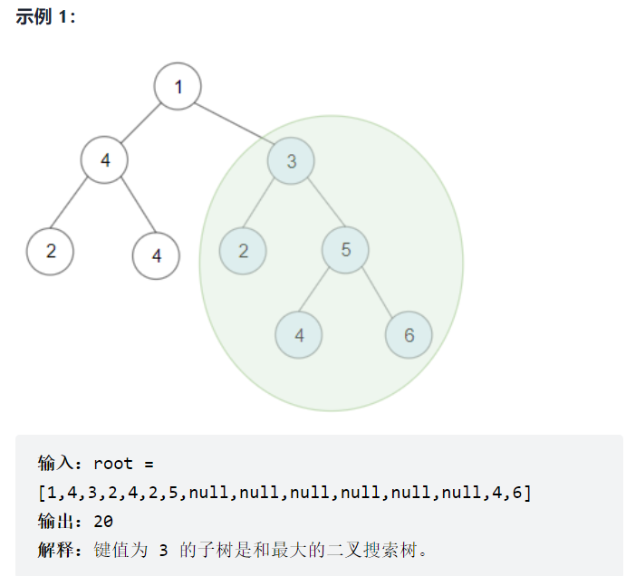
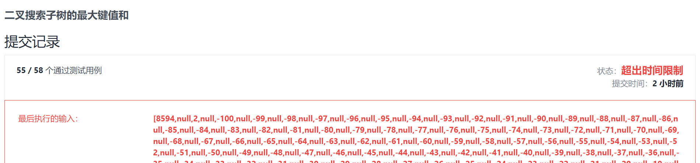

## 二叉树后序遍历的使用

有的题目通过后序遍历能够大规模地降低时间复杂度





我们知道一棵二叉树上，肯定是有搜索二叉树的，因为一个叶子节点也可以看成是一棵搜索二叉树

那么对于这道题，我们应该怎么解答呢


### 做法一

最开始，我的想法很简单，就是在遍历二叉树的过程中，验证以某个节点为根的子树是不是BST，如果是的话，则对这棵树进行求和

```java
class Solution {
    int res = 0;
    public int maxSumBST(TreeNode root) {
        // do something
        if (root == null) return 0;
        process(root);
        return res < 0 ? 0 : res;
    }

    public void process(TreeNode root) {
        if (root == null) return;
        if (isBST(root, null, null)) {
            res = Math.max(res, sumTree(root));
        }
        process(root.left);
        process(root.right);
    }


    public boolean isBST(TreeNode root, TreeNode max, TreeNode min) {
        if (root == null) return true;
        if (min != null && root.val <= min.val) return false;
        if (max != null && root.val >= max.val) return false;
        return isBST(root.left, root, min) && isBST(root.right, max, root);
    }


    public int sumTree(TreeNode root) {
        if (root == null) return 0;
        int left = sumTree(root.left);
        int right = sumTree(root.right);
        return root.val + left + right;
    }
}
```

但是这种做法，在`leetcode`中是不能够通过的，因为他的时间复杂度实在是太高了，**递归套着递归，这是不可取的**




### 做法二

上面的做法不可取，所以我们就需要想办法降低时间复杂度

我们抽取出上面代码中的核心部分，如下：

```java
    public void process(TreeNode root) {
        if (root == null) return;
        if (isBST(root, null, null)) {
            res = Math.max(res, sumTree(root));
        }
        process(root.left);
        process(root.right);
    }
```

发现在遍历过程中，我们需要判断这棵树是不是BST，以及通过遍历（递归）得到这棵树的sum

那么我能不能通过一次递归，得到全部的信息呢？很明显，是可以的！

- 如果我想要知道一棵树是不是二叉搜索树，我需要知道它的左子树是不是BST，右子树是不是BST

- 如果我想知道一棵树的sum，那么我需要知道它左子树的sum是多少，右子树的sum是多少

上面这两点都能够在遍历二叉树的时候知道了，不需要重复的递归嵌套，所以我们可以使用**后序遍历**

==**因为使用后序遍历的使用情景就是：如果当前节点要做的事情需要通过左右子树的计算结果推导出来，就要用到后序遍历**==

也就是说在遍历的过程中把上面两点的信息都带出来，所以我们的遍历函数可以修改为

```java
int maxSum = 0;

int[] traverse(TreeNode root) {
    if (root == null) {
        return new int[]{1, Integer.MAX_VALUE, Integer.MIN_VALUE, 0};
    }
    int[] res = new int[4];
    // res中有四个数据
    // res[0] 表示以root为根的子树是不是BST，0表示不是，1表示是
    // res[1] 表示以root为根的子树的最小值
    // res[2] 表示以root为根的子树的最大值
    // res[3] 表示以root为根的子树的全部节点的和
    
    int[] left = traverse(root.left);
    int[] right = traverse(root.right);
    if (left[0] == 1 && right[0] == 1
       && root.val > left[1] && root.val < right[2]) {
        res[0] = 1;
        res[1] = Math.min(root.val, left[1]);
        res[2] = Math.max(root.val, right[2]);
        res[3] = left[3] + right[3] + root.val;
        maxSum = Math.max(maxSum, res[3]);
    } else {
        res[0] = 0;   // 他不是一个二叉搜索树
    }
    
    return res;
}
```

