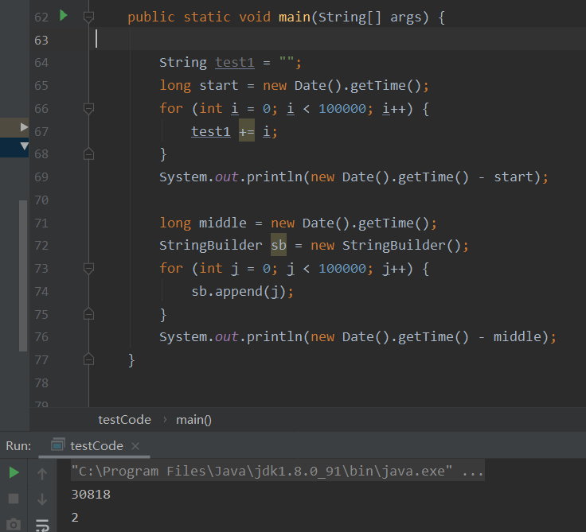
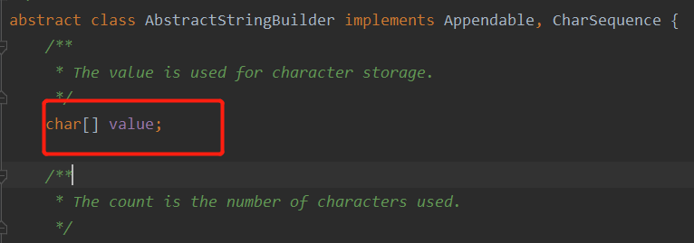
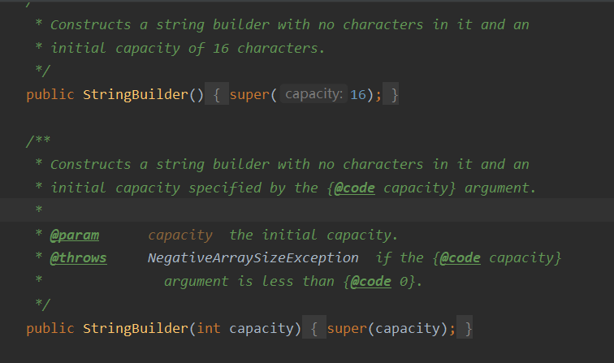
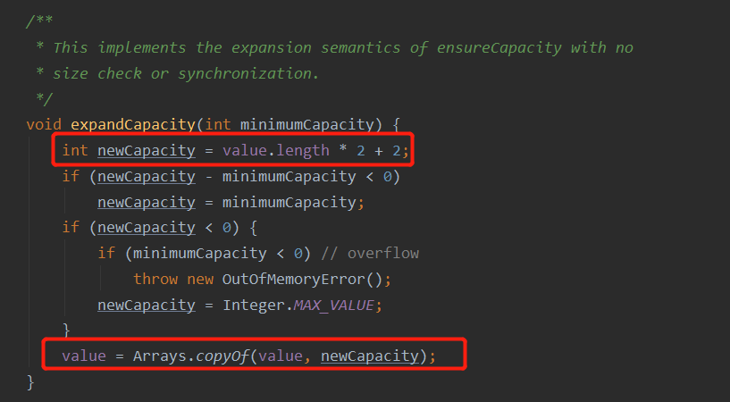
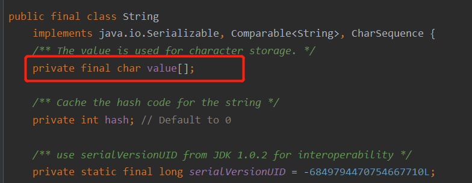
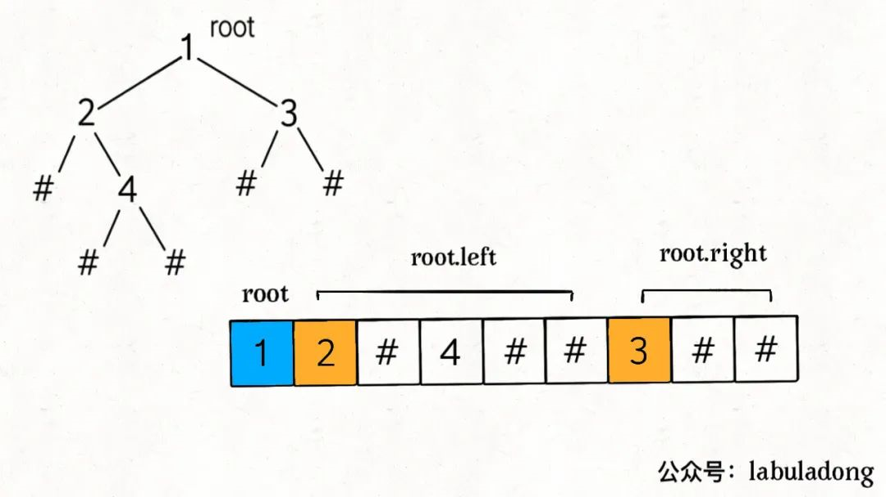
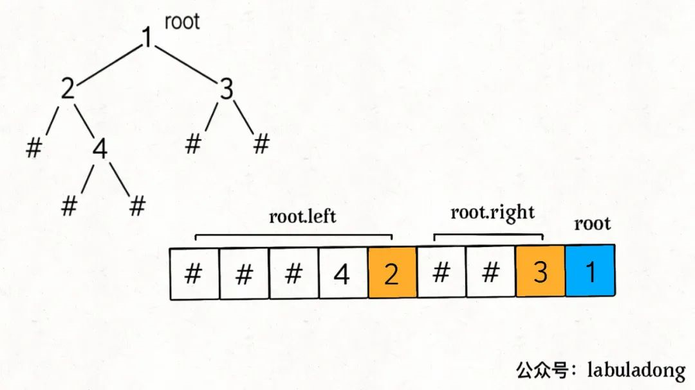
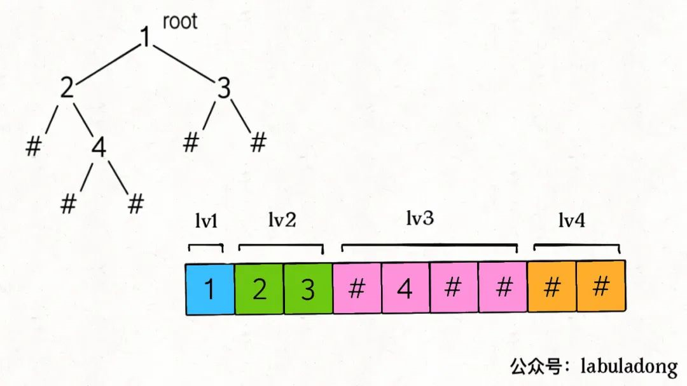

序列化和反序列化的目的就是以某种格式组织字符串，使数据能够独立于编程语言

```java
// 假设现在有一棵用 Java 实现的二叉树，我想把它序列化字符串，然后用 C++ 读取这棵并还原这棵二叉树的结构，怎么办？这就需要对二叉树进行「序列化」和「反序列化」了。
```


> **<font color=red size=4pt>leetcode 297 二叉树的序列化和反序列化</font>**

其实，没有看`labuladong`之前，我使用的是String，但是时间复杂度通不过，所以这里我首先调研了一下**为什么使用`StringBuilder`要比String快？！**



可以看到，`StringBuilder`的速度比String快了千倍~万倍

原因如下：

String在Java中是不可变长的，也就是说一旦初始化就不能修改长度，简单的字符串拼接其实是创建新的String对象，再把拼接后的内容赋值给新的对象，在频繁修改的情况下会频繁创建对象，而`StringBuilder`则不会，从头到尾只有一个对象



可以看到`StringBuilder`中有一个字符数组，在进行`append`的时候并不适用String存储，而是放到这个`value`数组中，字符串的长度是固定的，但是数组确是可以扩容的，这样就不需要不停地创建对象了


`StringBuilder`的默认长度是16，但是也可以根据构造方法指定，如下：



**扩容系数: `value.length * 2 + 2`,**而且只有当append是`数据长度+value.count > value.length`时才会扩容一次,不会每次都扩容去调用`Arrays.copyof()`




而**String使用final char[] value数组存储字符串内容**，每次修改是`return new String`返回一个新的字符串，需要重新生成一个字符串对象，申请内存空间，这花了时间，而`stringbuilder`类的value数组不是final的，是可变的，不需要重新生成新的对象，但是数组扩容其实也是换一个更大的数组罢了




> **回到这个题目，二叉树的序列化和反序列化**

首先，需要明确，二叉树的序列化和反序列化的核心其实就是二叉树的遍历，我们知道，在经典的遍历过程中，如果只根据前序遍历的顺序是没有办法还原这颗二叉树的，因为我们不知道空结点的位置

```java
void traverse(TreeNode root, List<TreeNode> res) {
    if (root == null) {
        return;
    }
    res.add(root);
    traverse(root.left);
    traverse(root.right);
}
```


**但是在序列化中不一样，我们可以使用一个特殊字符来代替空结点，比如`#`**


- 首先，如果我使用前序遍历进行序列化，可以得到如下图所示的结果

  

  很明显，使用前序遍历能够知道**根节点就是序列化字符串的第一个字符**，那么我们解码时就可以根据这个性质来对字符串进行处理

  ```java
      public Node deserialize_preOrder_helper(LinkedList<String> nodes) {
          if (nodes.isEmpty()) {
              return null;
          }
          String first = nodes.removeFirst();
          if (first.equals("#")) {
              return null;
          }
          Node root = new Node(Integer.parseInt(first));
          
          root.left = deserialize_preOrder_helper(nodes);
          root.right = deserialize_preOrder_helper(nodes);
          return root;
      }
  ```


- 第二，我们还可以使用后序遍历，序列化以后可以得到的结果如下图所示

  

  很明显，使用后序遍历能够知道**根节点就是序列化字符串的最后一个字符**，那么我们解码时就可以根据这个性质来对字符串进行处理

  但是我们需要注意的是，因为我们相当于是逆序处理字符串，所以先遇到的应该是右子树，因此在反序列化的时候应该先处理右子树

  ```java
  	public Node deserialize_postOrder_helper(LinkedList<String> nodes) {
          if (nodes.isEmpty()) {
              return null;
          }
          String last = nodes.removeLast();
          if (last.equals("#")) {
              return null;
          }
          Node root = new Node(Integer.parseInt(last));
          // 注意这里是先right，后left哦！！
          root.right = deserialize_postOrder_helper(nodes);
          root.left = deserialize_postOrder_helper(nodes);
          return root;
      }
  ```

  


通过上面前序遍历和后序遍历也可以看出，中序遍历不能够完成序列化，因为使用中序遍历没有办法确定根节点所在的位置

```java
 * * 比如如下两棵树
 * *         __2
 * *        /
 * *       1
 * *       和
 * *       1__
 * *          \
 * *           2
 * * 补足空位置的中序遍历结果都是{ null, 1, null, 2, null}
```


- 使用层序遍历，首先我们先写出层序遍历的框架

  ```java
  void traverse(TreeNode root) {
      if (root == null) return;
      // 初始化队列，将 root 加入队列
      Queue<TreeNode> q = new LinkedList<>();
      q.offer(root);
  
      while (!q.isEmpty()) {
          TreeNode cur = q.poll();
  
          /* 层级遍历代码位置 */
          System.out.println(root.val);
          /*****************/
  
          if (cur.left != null) {
              q.offer(cur.left);
          }
  
          if (cur.right != null) {
              q.offer(cur.right);
          }
      }
  }
  ```

  **上述代码是标准的二叉树层级遍历框架**，从上到下，从左到右打印每一层二叉树节点的值，可以看到，队列 `q` 中不会存在 null 指针。不**过我们在反序列化的过程中是需要记录空指针 null 的，**所以可以把标准的层级遍历框架略作修改：

  ```java
  void traverse(TreeNode root) {
      if (root == null) return;
      // 初始化队列，将 root 加入队列
      Queue<TreeNode> q = new LinkedList<>();
      q.offer(root);
  
      while (!q.isEmpty()) {
          TreeNode cur = q.poll();
  
          /* 层级遍历代码位置 */
          System.out.println(root.val);
          if (cur == null) {
              continue;
          }
          /*****************/
          q.add(root.left);
          q.add(root.right);
      }
  }
  ```

  这样就可以使用层序遍历完成序列化了

  

  **只不过我们在反序列化的时候变成了从队列中取出元素，如下代码：**

  ```java
  	public Node deserialize_levelOrder(String data) {
          if (data.equals("")) {
              return null;
          }
          String[] nodes = data.split(",");
          Node root = new Node(Integer.parseInt(nodes[0]));
          Queue<Node> q = new LinkedList<>();   // 用来存放父节点，保证顺序
          q.add(root);
          for (int i = 1; i < nodes.length;) {
              Node parent = q.poll();
              String left = nodes[i++];
              if (left.equals("#")) {
                  parent.left = null;
              } else {
                  parent.left = new Node(Integer.parseInt(left));
                  q.add(parent.left);
              }
  
              String right = nodes[i++];
              if (right.equals("#")) {
                  parent.right = null;
              } else {
                  parent.right = new Node(Integer.parseInt(right));
                  q.add(parent.right);
              }
          }
          return root;
      }
  ```

  

  其实可以看出，反序列化中的`for`其实就是根据层序遍历中的`while`变形来的

  

  

  

