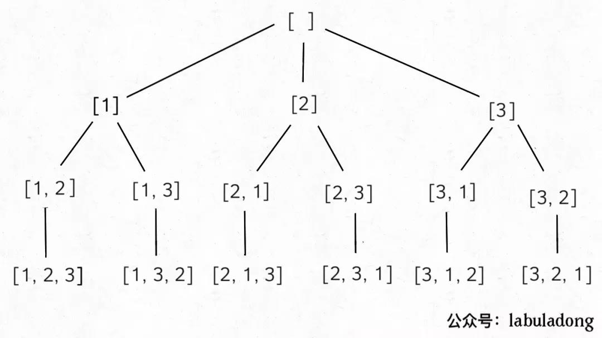
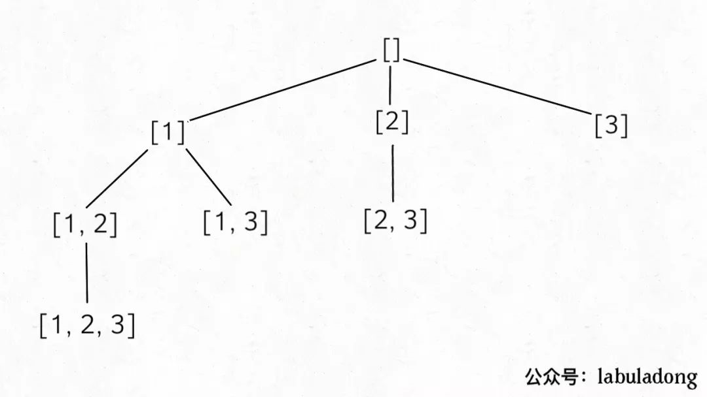
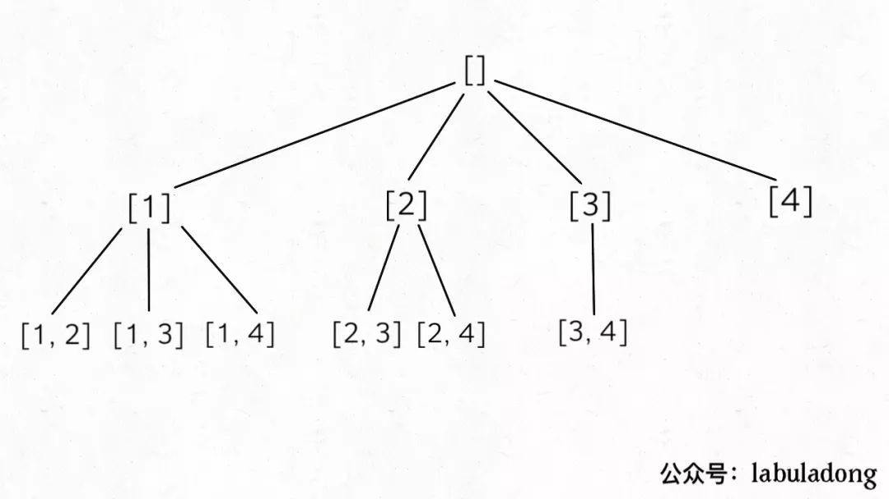

**回溯算法的框架**
```python
result = [];
def backtrack(路径, 选择列表):
    if 满足约束条件:
        res.add(路径);
        return;
    for 选择 in 选择列表:
        做选择
        backtrack(路径, 选择列表);  # 递归
        撤销选择
```
回溯算法就是穷举一颗决策树的过程，其重点就是解决要做出怎样的选择。

要注意全排列和子集/组合问题的区别，核心还是在于他们之间的决策树不一样

全排列中的决策树如下：



可以看到，在全排列的决策树中，访问完[1]之后，在[2]的子树中[1]还是会出现的

这种情况在子集和组合中就不会出现，因为集合{1,2}和集合{2,1}是一样的

所以，子集中的决策树是



访问完[1]之后，在后续的访问中他再也不会出现了，所以这里的代码略有不同

```java
for (int i = index; i < n; i++){
    // 做决定
    backtrack(.., i + 1);  // 这里是i+1，而不是index+1
    // 撤销决定
}
    // 通过一个index来确保index之前的数再也不会被访问到了
```

同理，组合中的决策树是



**排列、组合、子集都是使用回溯，而且一般涉及到了路径问题，基本上也是使用回溯，比如[二叉树的路径问题](https://leetcode-cn.com/problems/path-sum-ii/)**