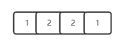
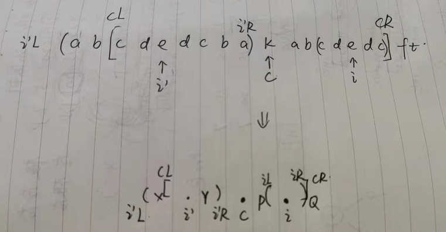

`manacher`算法是用来解决一个字符串中最大的回文字符串的长度

如果我们使用暴力算法，那么我们可以这么做


对于每一个字符都有两个向左和向右的指针，用来判断这两个指针指向的字符是否相同，如果相同，那么回文子串的长度+2，时间复杂度为$O(N^2)$


但是其实这种算法存在一个缺陷，就是如果字符串的长度为偶数的时候，就无法使用这种方式了，比如



对于这个字符串，如果按照我们上面的方式来计算的话，最终的最长回文字串长度为1，但是实际上应该是4，这是因为当字符串长度为偶数的时候，会把一些回文子串给跳过去，因为它的对称轴是一个虚轴


**上面的缺陷不只是针对于暴力解法，对于这种思想的算法都存在，包括`Manacher`，所以对于这种缺陷的解决方法是在对原始字符串求解最长回文子串开始之前，先预处理一下这个字符串，加上一个特殊字符，比如加上`#`，比如`#1#2#2#1#`，这样就能够进行求解了**


其实`Manacher`在一定程度上和KMP有点像，这两个算法都是在暴力解法的思想上对过程进行加速

- KMP是通过一个`next`数组跳跃式地寻找下一个比较节点
- `Manacher`也是通过一个回文半径数组加速匹配的过程


`Manacher`算法依赖于四个变量

- 回文直径 `#1#2#2#1#`，第二个1的回文直径是3
- 回文半径，第二个1的回文半径是2，自己和#
- R，表示的是当前回文半径能够达到的最右距离（右边界）
  - `#1#2#2#1#`在第一个`#`的时候，R=0，因为此时能够到达的最远距离就是自己，此时C=0
  - 在第一个1的时候，R=2，因为此时能够到达的最远距离是第二个`#`，此时C=1
  - 当到达第二个`#`的时候，R=2不变，因为此时没有回文子串，此时C=1，不变
  - ...
- C，表示的是中心点，和R同时变化，即R变化他就变化，R不变，他也不变


Manacher算法的运行过程中有四种情况

- 如果我来到一个点，这个点没有在回文右边界里面，那么此时我将暴力扩展

- 如果我来到一个点，他在回文右边界里面

  - `abcdck s kcdcba....`当我的`C`指向的是s的时候，回文区域就是``abcdck s kcdcba`，如果我的当前字符指向了`d`，也就是说目前的字符是在回文右边界区域里面，此时，d的回文长度和第一个d的长度是相同的，证明过程如下：

    

     假设当前的中心点是`S`，其回文区域是`L`到`R`这一段的区域，假设现在指向的是`i`字符，其回文串是我所画出来的这一部分，根据`i`肯定能够根据中心点`S`找出一个对称点 `i'`，所以`i`的回文区域一定是大于等于`i'`的，为什么不能大于呢？
  
    我们能够把图给抽象成下面这一张，假设`i'`所表示的回文区域的前一个字符是`x`，后一个字符是`y`，同理`i`
  
    因为`i'`的回文区域没能包括`x,y`，所以x一定是不等于y的，因为他们又都在`C`表示的中心节点的回文区域里，所以`x=p,y=q`，所以p也不等于q
  
    
  
  - `ab cdedc ba k ab cdedc ft`，当我的中心点指向`K`的时候，回文区域是`cdedc ba k ab cdedc`，如下图
  
    
  
    从上图可以看出，`i'`的回文区域在`C`回文区域的外面，但是这种情况也是可以直接得出答案的，我们假设`CL`的前一个字符是`X`，与`i'`对称的一点为`Y`，因为他们两个都在`i'`的回文区域内，所以`X == Y`，假设`i`回文区域的前一个字符和后一个字符分别为`P,Q`，`i`到`P`的距离和`i'`到`Y`的距离是相同的，距离都是`i`的回文半径，而且他们又都在`C`的回文区域内，所以`Y == P`，而`X`和`Q`不在`C`的回文区域内，所以`X != Q`，所以`P != Q`，所以`i`的回文区域只能这么大
  
    
  
  - 第三种情况，我们假设`i'`的回文半径刚好落在`L`上，既没有完全在里面，也没有超过，如下图
  
    
  
    这种情况下就不能够直接得出回文区域了，但是这时候会有一个小的加速，因为以`i到R`这段距离为半径肯定是一个回文区域，但是后面还是不是，就需要去判断了，比如`?`的字符如果是`K`，那么回文区域可以往外扩，如果不是，则不能往外扩


```java
// manacher伪代码
public int[] manacher(String s) {
    1.把s处理一下，变成str，防止他是偶数个，加个特殊字符   --> char[] str
    2.int[] pArr = new int[str.length]
    3.int R = -1  
    4.int C = -1
    for (int i = 0; i < str.length; i++) {
        if (i 在 R的外部) {
            从i开始往两边暴力扩
        } else{
            if (i1的回文区域完全在[L...R]内) {   // i1代表i‘
                pArr[i] = 某个O(1)的表达式
            }else if (i1的回文区域有一部分超出了[L...R]) {
                pArr[i] = 某个O(1)的表达式
            } else {   // i'的回文区域压线
                从R之外的字符开始往外扩，然后确定pArr[i]的值
            }
        }
    }    
}
```


  