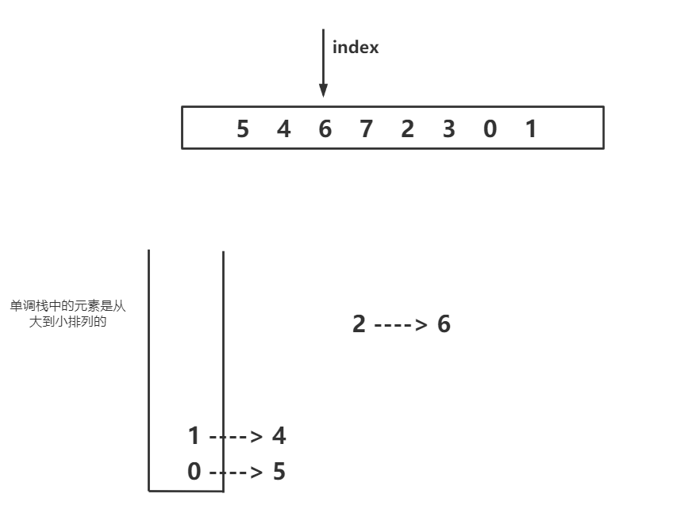
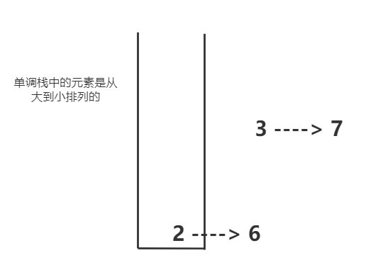
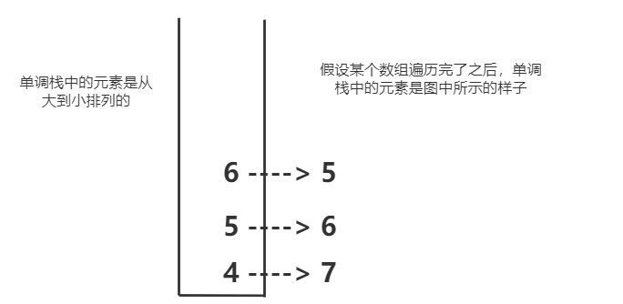
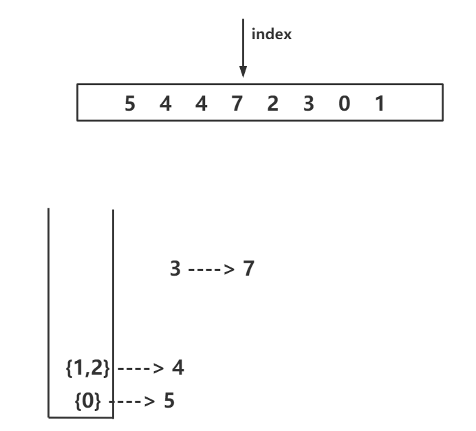

在数组中想找到一个数，左边和右边比这个数小，且离这个数最近的位置

如果对每一个数都想要求这样的信息，能不能使整体代价达到`O(N)`，这里就需要使用单调栈结构了

至于暴力的解法，我们可以使用一个指针指向当前的数，分别遍历其左边和右边，找到比这个数小且最先出现的数

当`index == 2`的时候，发现如果把6这个数值给放入到单调栈中会导致单调栈中的元素规则被破坏，如下图：

所以将下标为1的元素从栈中弹出来，注意，**在单调栈中，弹出就要生成信息**

- `1 ----> 4`右侧比他大的离他最近的是`2 ----> 6`，左侧比他大离他最近的是`0 ----> 5`

- 将`1---->4`弹出之后，发现栈中的元素如果放入`2----> 6`之后仍然不能够满足规则，所以将`0----> 5`也弹出，然后生成`0 ----> 5`的信息，`0 ----> 5`右侧比他大的离他最近的是`2 ----> 6`，左侧比他大离他最近的是 没有

- 因为，此时栈中没有数据了，所以可以把`2 ----> 6`插入栈中

- 同理，因为`7 > 6`，所以要把`2 ----> 6`从栈中弹出来，并生成信息，`2 ----> 6`左侧比他大离他最近的数没有，右侧比他大的数离他最近的数是`3----> 7`，接下来以此类推

  

- 如果`index == arr.length - 1`，但是此时栈中不为空，那么这时候就要进行弹栈操作了，因为数据弹出就要生成信息，如下图

  

  此时，进行弹栈，并生成信息

  - 将`6 ----> 5`弹出栈，左侧比他大且距离最近的元素是`5 ----> 6`，**右侧比他大且距离最近的元素没有**
  - 将`5 ----> 6`弹出栈，左侧比他大且距离最近的元素是`4 ----> 7`，**右侧比他大且距离最近的元素没有**
  - 将`4 ----> 7`弹出栈，左侧比他大且距离最近的元素是没有，**右侧比他大且距离最近的元素没有**

如果数组中有重复数据，那么可以将单调栈中元素类型设置成链表结构，将具有相同值得元素放到同一个链表中，如下：

当`3 ---> 7`想要进栈的时候，首先弹出的是`2 ---> 4`并生成信息，然后弹出`1--->4`并生成信息

**原理：为什么单调栈能够找到某个数字左右两侧比他大而且离他最近的数字**

假设当前元素是`C`，单调栈中的元素是`a,b`，因为单调栈的规则，`a > b`，假如当前`C > b`，我们让`b`弹出，那么为什么弹出的`b`生成的信息是对的呢？

首先，c在b的右边，因为c比b后遍历，

- 而且在b和c之间的所有数不可能大于b，因为如果大于b，那么在遍历到c之前，b这个元素就会被弹出栈了，所以c是第一个在b右边比它大的数

- 因为b比a更靠近栈顶，也就意味着a一定比b早进栈，

  - 这两个数中间位置的数有可能是小于b的，比如`a=7，b=5`，如果他们两个中间有一个数是3，那么在5出现之后这个3会被弹出了，ab仍然是邻居
  - 这两个数中间位置的数有可能是大于b的吗？不可能，因为如果是大于a的数，那么a和b一定不可能是邻居了，比如`a=7，b=5`，如果他们两个中间有一个数是6，那么栈中肯定就是`765`

  所以，a一定是左边离b最近且大于b的数

