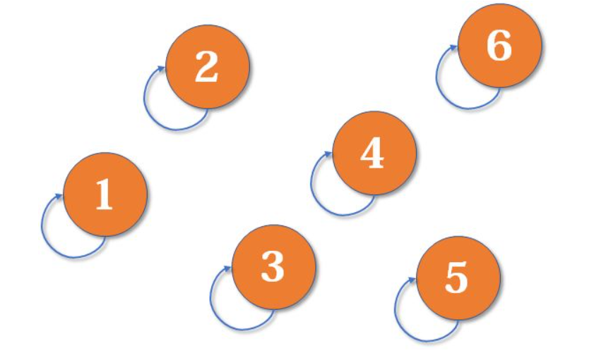
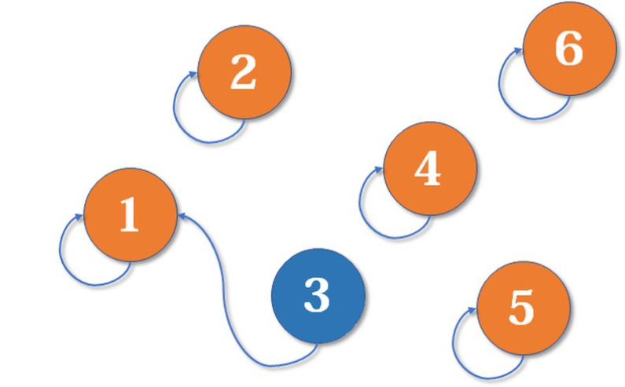
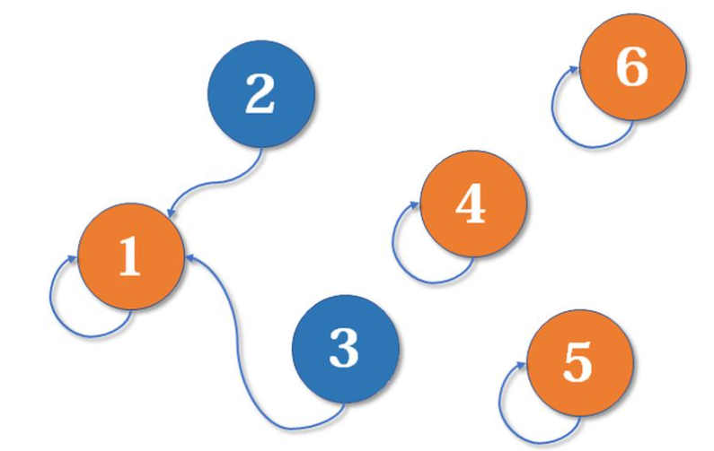
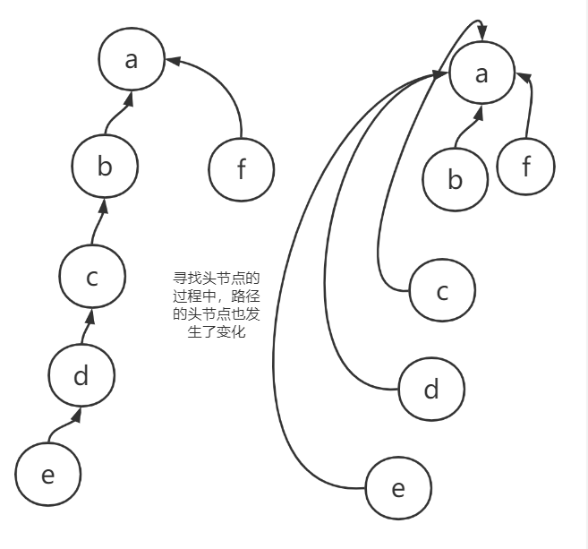

## 并查集

### 基础结构与操作

并查集被很多OIer认为是最简洁而优雅的数据结构之一，主要用于解决一些**元素分组**的问题。它管理一系列**不相交的集合**，并支持两种操作：

- **合并**（Union）：把两个不相交的集合合并为一个集合。
- **查询**（Find）：查询两个元素是否在同一个集合中

并查集在实现这两个操作时的时间复杂度都是O(1)

**那么在并查集中这两个操作是怎么实现的呢？**

并查集的重要思想在于，**用集合中的一个元素代表集合**。如上图所以，最开始的6个节点，每一个节点都表示一个集合，集合中的元素只有自己，而且他们都有一个头指针，指向的是自己

- 对于查询操作，比如查询节点1和节点2是不都是属于同一个集合，具体的做法是：查看这两个节点的头节点往最上层指，直到最后，看看最后的这个节点是不是一样的，如果是一样的，那么证明他们两个属于同一个集合，如果不是一样的，那么他们两个不在同一个集合中

  - 比如节点1和节点2，节点1往上指的指针最后还是自己，同理节点2，所以他们两个就不在同一个集合中

- 对于合并操作，比如现在节点1和节点3已经在同一个集合中了，如果我想要将节点2也合并到这个集合中，我需要做的是

  

  首先，我要去查询一下节点13所在的集合和节点2的集合是否为同一个，如果是同一个，那么没必要再进行合并了，如果不是同一个，那么需要把节点2挂到节点13所在集合的头节点的下面，也就是把节点2挂到节点1下面，如下图

  

从上面查询和合并的过程中我们可以发现，其中**向上找**这个动作非常关键，对于这个动作做了优化，将并查集给**扁平化了**

上图所示的过程会在寻找头节点时完成，之所以进行这样的优化是因为如果链过长，那么势必会造成性能瓶颈，如此将这个集合扁平化了能够保证链不会过长，仍然可以在常数级别完成查询和合并操作

### 并查集的应用

我们实现了“岛问题”，那么现在思考一个问题，如果我给出的这个矩阵非常非常大，要求设计一个并行算法来解决岛问题应该怎么办？

| 1（A） | 1    | 1      | 1（边界，被A infect 得到） | 1（边界，C，即是初始点，又是感染点） | 1    | 1    | 1    |
| ------ | ---- | ------ | -------------------------- | ------------------------------------ | ---- | ---- | ---- |
| 1      |      |        | 边界                       |                                      |      |      | 1    |
| 1      |      |        | 边界                       |                                      |      |      | 1    |
| 1      |      | 1（B） | 1（边界，被B infect 得到） | 1（边界，被C感染得到）               | 1    | 1    | 1    |
| 1      |      | 1      | 边界                       |                                      |      |      |      |
| 1      |      | 1      | 1（边界，被B infect 得到） | 1（边界，D，即是初始点，又是感染点） | 1    | 1    | 1    |
| 1      |      |        | 边界                       |                                      |      |      | 1    |
| 1      | 1    | 1      | 1（边界，被A infect 得到） | 1（边界，被D感染得到）               | 1    | 1    | 1    |

比如给出一个这样的矩阵（假装很大），没有写的地方都是0，可以看到如果在单个CPU上计算的话最后的结果就是只有1个岛

如果我把1-4列的数据拿出来，放到一个CPU上运行，5-8列的数据拿出来放到另一个CPU上运行，那么每个COU上都会计算出有2个岛来，那么此时计算出来的是有4个岛，这显然是不正确的，所以这也是我们在并行计算中要解决的问题

我们的解决方法是**记录边界点是由哪个点`infect`得到的**

可以看到，上面的边界点被分成了4个部分，分别是被A感染得到的，被B感染得到的，被C感染得到的和被D感染得到的，接下来就可以使用并查集了

- 4个部分首先被当成了4个集合，`{A},{B},{C},{D}`
- `{A}`和集合`{B}`是不是同一个集合呢？不是，所以 4 - 1 = 3
- 集合`{C}`和集合`{AB}`是不是同一个集合呢？不是，所以3-1=2
- 集合`{D}`和集合`{ABC}`是不是同一个集合呢？不是，所以2-1=1
- 集合`{D}`和集合`{ABCD}`是不是同一个集合呢？是，所以岛的数量不变
- 至此，所有的集合都被判断完了，所以给定区域内只有1个岛

