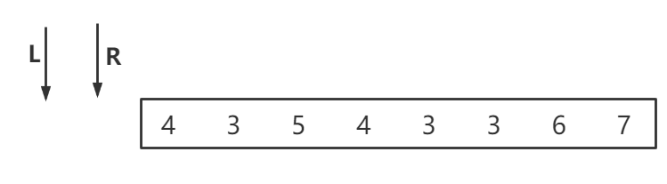

维护一个双端队列，双端队列的意思是头部既能够插入元素也能够弹出元素，同样，队尾也是既能够插入元素也能够弹出元素

**双端队列中元素始终是从大到小排列的**

双端队列中维持的信息是如果目前窗口状况不再扩大了（R不再往右动了），如果我让L往右动，那么窗口中的最大值依次是谁（就是L指向的元素）

如果这个双端队列维持的好，那么队头元素始终会是窗口中的最大值

**假设给定一个字符最开始是下图所示的样子：L和R都指向index=-1的位置**

**如果R动，L暂时先不动的话，双端队列会发生下面的变化**

- 如果R移动到index = 0的位置，因为双端队列中目前没有值，所以可以直接把他插到里面，这里选择插入的是下标，因为下标能够承载更多的信息

  

- 紧接着，R继续向右侧移动，因为3小于4，所以符合我们双端队列元素是从大到小排列的规则，因此，可以直接把下标1也插入进去

- R继续向右侧移动，因为5大于3了，所以此时需要把3从尾部弹出队列，4同样还是小于5，也把4弹出去，此时双端队列为空，下标2入队

  

- R继续向右侧移动，后面的433都能够符合双端队列中从大到小的排列，所以这几个数字都能够入队，如下图

  

- R继续向右侧移动，碰到了数字6，很显然，6比在队列中的这些数字都大，所以要把队列中的数字全部一次弹出，直到队空，然后把6放进去

  

- R继续向右侧移动，此时双端队列中只有6这个数，但是7比6大，所以要把6从队列中弹出去

  

可以看出，当R向右移动时，也就是这个滑动窗口变大的时候，要保证入队的数据不能够破坏双端队列中规则：从大到小排列

如果L向右移动时，他表示的就是滑动窗口的减小，每移动一位，就把队头的数据给弹出去，表示这个数据已经过期了

假设，当R移动到这个位置时候，L开始移动，此时双端队列中数据的状态是

当L从`index=-1`移动到`index = 0`的时候，会指向队列中的第一个元素，那么此时就把第一个元素给弹出去，表示他已经过期了

此时，队列中的最大值变成了下标为3代表的元素4

