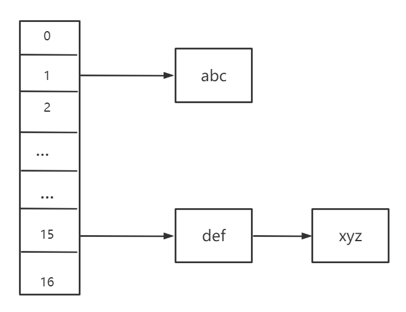

### 哈希函数

在某种程度上，哈希和排序是相反的两种操作，排序是将集合中的元素按照某种方式排列在一起，而散列通过计算哈希值，打破元素之间原有的关系，使集合中的元素按照散列函数的分类进行排序

#### 为什么要hash

举一个例子，我们通常使用数组或者链表来存储元素，一旦存储元素的数量特别多的时候，需要占用很大的内存空间，而且**在查找某个元素是否存在的过程中，数组和链表都要从头到尾进行遍历查询，也就是时间复杂度为O(N)，而通过哈希之后，能够大大减少查找的次数，在常数时间内就能够找到对应的元素，也就是时间复杂度为O(1)**

 比如一个数组`arr=[2,5,9,13]`，如果我想要找到13，那么我需要遍历4次，而如果我在存储时使用哈希函数进行散列（比如`arr[i] % 3` ），那么四个数对应的哈希值分别为`[2,2,0,1]`，然后把它们存储到对应的位置，当我再次寻找`13`的时候，我只需要通过相同的hash函数计算出`13`的哈希值来，就能够找到对应的位置，也就是说只需要通过一次查找就能够找到对应的位置，时间复杂度为O(1)

**因此可以发现，哈希 其实是随机存储的一种优化，先进行分类，然后查找时按照这个对象的分类去找。**

**哈希通过一次计算大幅度缩小查找范围，自然比从全部数据里查找速度要快。**


#### 经典的哈希函数

- 首先，经典的哈希函数中的输入是无穷的，经过哈希之后的输出是有穷尽的，因为哈希函数能够表示的值是有限的，比如`MD5`，他能够表示的数据范围就是`0~2^64-1`，而`SHA1`能够表示的数据范围就是`0~2^128-1`,经过MD5哈希之后的输出其实是一个字符串，一共16位，每一位上都是一个16进制的数，也就是有16种不同的数，所以这个字符串的范围是`16^16=2^64`，之所以-1是因为从0开始，同理SHA1，这个的输出是一个含有32个字符的字符串，`32^16`
- 对于一个哈希函数，相同的输入参数，输出一定相同
- 因为输入域是无穷大的，而输出域是有限的，所以即使输入不同，输出也可能相同，这就是**哈希碰撞**
- 假设经过哈希之后的输出都在一个域上，如果在这个域上的不同位置选取相同的大小面积，那么选取出来相同大小面积中的输出的个数相差不大，也就是说经过**哈希之后的数据虽然是没有规律的，但是会均匀地分布在一个域上**

**哈希函数最重要的两个性质就是离散型和均匀性，而均匀性是源自离散性的，离散型越好，均匀性就越好，比如有一组规律性十分强的数据，经过哈希函数之后也会把其中的规律破坏掉，将他们离散到某个域上，只有离散的越号，均匀性才越好**

**<font color='red'>对于一组输入样本，如果我经过哈希函数之后在`%m`，那么输出也会在`[0,m-1]`范围内均匀分布</font>**


#### 哈希函数的一个应用

我现在有一个大文件，其中大约有40亿个数据，数据都是无符号的整数，范围是`0~2^32`,我只给分配1G内存，请问如何求出这个文件中出现最多的数据

- 如果我是用HashMap来做的话，那么最坏的情况是，这40多亿个数据都是不同的，这时需要的内存计算方式是

  ```java
  // HashMap<Integer, Integer> int类型是4个字节，那么哈希表中的一条记录就是8个字节，这还是去除了链表指针的空间
  // 40亿条数据所占空间大约为 32G，很明显是大于了1G
  ```

- 所以我们不能够使用经典的HashMap来求出出现次数最大的数

  我们知道，其实HashMap占空间最怕的是不同的数，因为如果是相同的数，比如有10000个3，那么在Hashmap中存的是(3,10000)，同样还是8字节

  所以我可以通过 先对这40亿个数据进行哈希函数计算，然后再%100，这样我们就可以把这40多亿个数给划分成100个小文件，相同的数据肯定是在同一个文件中的，同样根据哈希函数的均匀性，不同的数也会均匀地进入这100个文件中，所以我们可以通过对这100个文件逐步进行处理得到出现次数最多的数，此时内存消耗最多是`32G/100=0.32G`


### 哈希表

哈希表其实就是数组和链表的组合，当我想往哈希表中存入一个数据时，我先通过哈希函数对这个数据进行计算然后取模（哈希表的长度），将数据散列到哈希表中，如下图



由此也可见**在哈希表中进行增删改查操作的时间复杂度为O(1)**

但是也可以发现一个问题，如果哈希表中的链的长度过长，那么哈希表的效率也会不尽如人意，最差的情况也会遍历完整条链的长度，而且因为均匀性，哈希表中每条链的长度都不会相差太多，所以当链的长度过长时，我们就需要对哈希表进行扩容

链的长度过不过长只看一条链是否超过了我们设定的阈值就好了，比如我们设置当链的长度超过6的时候，就进行扩容，那么我们就会成倍地增加哈希表的容量，上面是17，下面就将设置成34，当设置成34之后，会对所有的数据重新算一遍哈希值，然后散列到34的空间中去，这样在扩容后的哈希表中每条链的长度都在3左右


如果我的哈希表中已经有了N个数据，那么我已经进行了$log N$次扩容，实际情况会低于这个$log N$，但是他是这个级别的，因为$log N$的情况下，哈希表的初始长度被定义成了2了，所以当加入了N个数据之后，扩容的总代价是`O(N*logN)`，平均下来就是`O(log N)`

而且对于Java这种语言，JVM可以在用户离线的时候对哈希表进行扩容工作，这样又进一步地加快了哈希表的使用速度


上面所说的是经典结构，具体语言中还进行了不同的改进，比如将单链表给改成树等等，但是原理都是上面这样的


### 布隆过滤器

场景：我的公司中建立了一个黑名单，黑名单中有100亿条url，当用户访问某个url的时候我首先需要在黑名单中查询是否包含这个url，如果不包含，那么允许访问，如果包含，那么不允许访问，而且如果一个url被举报为违法网站，那么也将被加入到url中

很显然，上面的场景中涉及到了两个操作，查询和添加，其实如果数据量小的话，使用一个`HashSet`就可以完成业务，但是对于100亿条的黑名单，使用`HashSet`显然是不够合理，因为他所占的内存太大了，而且如果使用硬盘的话，访问时间又太慢了，因此这种场景下就引出了布隆过滤器，**布隆过滤器的出现就是为了节省空间，但是允许一定的失误率**

这里的失误有两种情况

- 第一种情况是：当前url是黑名单里的url，但是却被误报成不是黑名单里面的东西（黑的报成白的）
- 第二种情况是：当前url不是黑名单里的url，但是却被报成了是黑名单里面的东西（白的报成黑的）

**在布隆过滤器中，第一种情况是不可能出现的，原因下面将解释，而且布隆过滤器可以通过设置将第二种情况的误报率降到很低，但是不能避免**


#### 位图

假如我们定义一个数组`int[] arr = new int[100]`，我们可以把这个数组看成有100个格子，每一个格子中存放一个`int`类型的数据，一个int类型的数据的大小为4字节，32位，而位图就是把每一位都当成一个存储空间，位图的构建就是通过其他基础类型来凑的，因为操作系统是按照字节来划分内存空间的，**所以使用位图能够比使用`int`进行存储能够节省`1/8`的空间**


#### 布隆过滤器的实现

1. 首先需要k个hash函数，每个函数可以把key散列成为1个整数
2. 初始化时，需要一个长度为n比特的数组，每个比特位初始化为0
3. 某个key加入集合时，用k个hash函数计算出k个散列值，并把数组中对应的比特位 置为1
4. 判断某个key是否在集合时，用k个hash函数计算出k个散列值，并查询数组中对应的比特位，如果所有的比特位都是1，认为在集合中

从上面的过程中也可以看出，使用布隆过滤器不可能把黑名单中的url给判断成白的，因为对于同一个黑名单中的url，k个哈希函数算出来的值都是相同的，而位图中相应的位置都被标记上了，所以不可能把黑的判断成白的

为什么能把白的判断成黑的呢？因为如果我的位图被占满了，也就是位图中全部的位都被标记成1了，那么即便是来一个白的，判断出来仍然是黑的


所以，当样本量固定时，位图的长度越大，失误率会越小

当样本量和位图长度固定时，随着哈希函数的增多，失误率会先减少，在增大，原因是：k个哈希函数相当于对样本采取指纹，采取的越多，判断的越准确，但是占用位图中的位置也越多，所以失误会先减少在增大


在布隆过滤器中，样本的大小对任何事情都没有影响，只要是哈希函数能够给这个样本算出一个哈希值就行

假设样本量是$n$，失误率是$p$

布隆过滤器的大小（也就是位图的长度）$\Large m=-\frac{n*lnp}{(ln2)^2}$

哈希函数的个数 $\Large k=ln2 * \frac{m}{n} \approx 0.7 * \frac{m}n$，算出来的理论上的哈希函数和实际的哈希函数相差不大

真正的失误率$\Large p_{real}=(1-e^{-\frac{n*k_{real}}{m_{real}}})^{k_{real}}$


### 一致性哈希

#### 场景描述

假设，我们有三台缓存服务器，用于缓存图片，我们为这三台缓存服务器编号为0号、1号、2号，现在，有3万张图片需要缓存，我们希望这些图片被均匀的缓存到这3台服务器上，以便它们能够分摊缓存的压力。也就是说，我们希望每台服务器能够缓存1万张左右的图片，那么，我们应该怎样做呢？

- 如果我们没有任何规律的将3万张图片平均的缓存在3台服务器上，可以满足我们的要求吗？可以！但是如果这样做，当我们需要访问某个缓存项时，则需要遍历3台缓存服务器，从3万个缓存项中找到我们需要访问的缓存，遍历的过程效率太低，时间太长，当我们找到需要访问的缓存项时，时长可能是不能被接受的，也就失去了缓存的意义，缓存的目的就是提高速度，改善用户体验，减轻后端服务器压力，如果每次访问一个缓存项都需要遍历所有缓存服务器的所有缓存项，想想就觉得很累，那么，我们该怎么办呢？
- **原始的做法是对缓存项的键进行哈希，将hash后的结果对缓存服务器的数量进行取模操作**，通过取模后的结果，决定缓存项将会缓存在哪一台服务器上，这样说可能不太容易理解，我们举例说明，仍然以刚才描述的场景为例，假设我们使用图片名称作为访问图片的key，假设图片名称是不重复的，那么，我们可以使用如下公式，计算出图片应该存放在哪台服务器上。


其实从上面的算法来看，当作数据划分时，尽量选择种类比较多的key，因为这样才能够保证数据经过hash之后，能够均匀分布，服务器能够做到负载均衡，就比如有3台服务器，我如果使用性别作为key，那么hash(key)之后的结果只有两种结果，所以这三台机器中只能用到2台，所以这样就没办法做到负载均衡


但是使用上面这种Hash算法存在一个缺陷，如果3台服务器不能够满足我们的缓存要求了，那么我们应该怎么做？很简单，增加几台服务器就好了，加入我们的服务器数量从3台增加到了4台，此时，如果仍然使用上面的方法对同一张图片进行缓存，那么这张图片所在的服务器编号必定与原来3台服务器时所在的服务器编号不同，因为除数由3变为了4，被除数不变的情况下，余数肯定不同，这种情况带来的结果就是**当服务器数量变动时，所有缓存的位置都要发生改变**，**换句话说，当服务器数量发生改变时，所有缓存在一定时间内是失效的，**当应用无法从缓存中获取数据时，则会向后端服务器请求数据，同理，假设3台缓存中突然有一台缓存服务器出现故障，无法进行缓存，那么我们则需要将故障机器移除，如果移除了一台机器使得缓存服务器从3台变成了2台，如果想要访问一张图片，这张图片的缓存位置必定会发生改变，以前缓存的图片也会失去缓存的作用与意义，由于大量缓存在同一时间失效，造成了缓存的雪崩，此时前端缓存已经无法起到承担部分压力的作用，后端服务器将会承受巨大的压力，整个系统很有可能被压垮，所以，我们应该想办法不让这种情况发生，但是由于上述HASH算法本身的缘故，使用取模法进行缓存时，这种情况是无法避免的，**为了解决这些问题（数据迁移的代价过高），一致性哈希算法诞生了。**


#### 一致性哈希

我们上面的传统方法中是对服务器的数量进行取模，而是用一致性哈希在本质上也是属于取模，但是它取模的数是哈希函数的范围，比如使用MD5做哈希的时候，模2^64 - 1，

首先，我们把二的六十四次方想象成一个圆，就像钟表一样，钟表的圆可以理解成由60个点组成的圆，而此处我们把这个圆想象成由2^64个点组成的圆，示意图如下


我们称上面这个环为哈希环

假设我们有3台缓存服务器，服务器A，服务器B，服务器C，那么在生产环境中每台服务器肯定有自己的IP地址、MAC地址等，我们可以选择一个来做哈希值，这里就选择IP地址来做哈希值，哈希后的结果模2^64，即

```bash
# hash（服务器A的IP地址） %  2^64
# hash（服务器B的IP地址） %  2^64
# hash（服务器C的IP地址） %  2^64
```

通过上面公式计算出来的结果一定是`[0,2^64-1]`这个范围上的，也就是肯定在环上，我们就是用算出来的那个值分别作为服务器A,B,C上的位置，这样就能够把服务器映射到环上，如下：


**上面的这种是最理想的情况（3台服务器各占环的三分之一，后面会讨论不理想的情况）**

如果我们需要往服务器上缓存图片，那么我们可以使用`hash(图片) % 2^64`计算出图片在环上的位置，如下图，那么这个图片应该缓存到哪一台服务器上呢？


这张图片应该被缓存到A服务器上，**因为这个图片沿着顺时针转动最先遇到的是A服务器，所以就把它给缓存到A服务器上**

一致性哈希就是通过这种方式判断一个对象应该被缓存到哪台服务器上的，将缓存服务器与被缓存对象都映射到hash环上以后，从被缓存对象的位置出发，沿顺时针方向遇到的第一个服务器，就是当前对象将要缓存于的服务器，由于被缓存对象与服务器hash后的值是固定的，所以，在服务器不变的情况下，一张图片必定会被缓存到固定的服务器上，那么，**当下次想要访问这张图片时，只要再次使用相同的算法进行计算，即可算出这个图片被缓存在哪个服务器上，（这里可以在外部记录服务器的哈希值，然后计算出图片哈希值之后去做二分，二分右边部分的最左便是对应的服务器）直接去对应的服务器查找对应的图片即可。**


#### 一致性哈希的优点


如果去掉了B服务器，那么B服务器上的数据根据一致性哈希的算法会被迁移到C服务器上，由于哈希函数具有均匀性，那么迁移的数据量应该是总数据量的1/3，这就是一致性hash的优点，如果使用之前的hash算法，服务器数量发生改变时，所有服务器的所有缓存在同一时间失效了，而使用一致性哈希算法时，服务器的数量如果发生改变，并不是所有缓存都会失效，而是只有部分缓存会失效，前端的缓存仍然能分担整个系统的压力，而不至于所有压力都在同一时间集中到后端服务器上


#### 哈希环的偏斜

我们上面说了，服务器A,B,C最理想的状态就是三等分这个哈希环，但是在现实情况中，极少情况下能够被映射出等分，很容易会出现偏斜的现象，如下：


如果三台服务器被映射成了上图这种情况，很容易就造成大部分数据都会落到一台服务器上，


上图中，1号、2号、3号、4号、6号图片均被缓存在了服务器A上，只有5号图片被缓存在了服务器B上，服务器C上甚至没有缓存任何图片，如果出现上图中的情况，A、B、C三台服务器并没有被合理的平均的充分利用，缓存分布的极度不均匀，而且，如果此时服务器A出现故障，那么失效缓存的数量也将达到最大值，在极端情况下，仍然有可能引起系统的崩溃，上图中的情况则被称之为hash环的偏斜，

所以哈希环的偏斜能够导致服务器缓存分布不均匀，负载不均衡。

那么，我们应该怎样防止hash环的偏斜呢？一致性hash算法中使用”虚拟节点”解决了这个问题


#### 虚拟节点

使用虚拟节点能够解决服务器分布不均匀和负载均衡问题，我们知道，如果想让服务器尽可能地均衡的出现在哈希环上，我们可以通过让他们尽可能地多，因为哈希函数具有均匀性，但是我们真真正正地只拥有3台服务器，怎样出现更多相同的服务器呢，这就用到了虚拟节点技术

**凭空的让服务器节点多起来，既然没有多余的真正的物理服务器节点，我们就只能将现有的物理节点通过虚拟的方法复制出来，这些由实际节点虚拟复制而来的节点被称为”虚拟节点”。**一个实际的节点可以对应多个虚拟节点


**虚拟节点越多，缓存被均匀分布的概率就越大**
