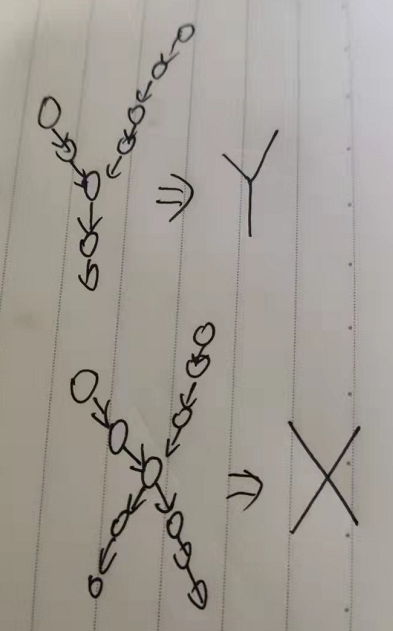
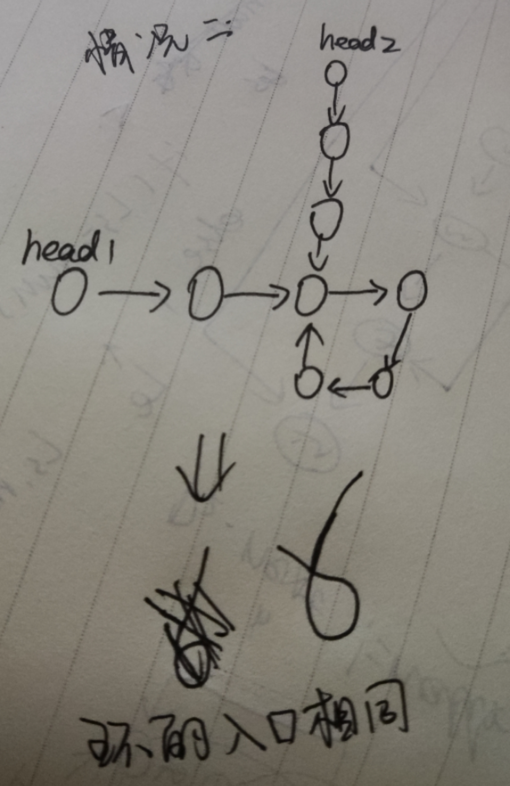
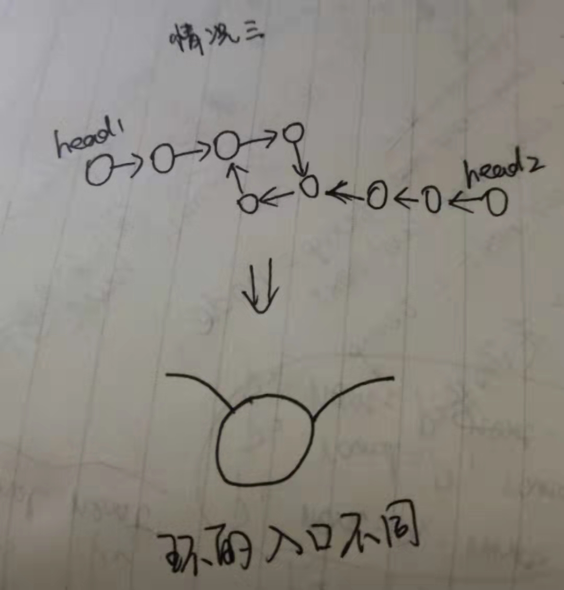

**题目：输入两个链表的头节点，判断这两个链表是否存在相交，链表不知道有没有环**

相交的意思是两个链表中的数据是否为相同的地址

这个题目其实有三种解法

- **暴力解法**
  从头开始遍历一个链表，遍历第一个链表中的每个节点时，同时从头到尾遍历第二个链表，看是否有相同的节点，第一次找到相同的节点即第一个交点；若遍历结束未找到相同的节点，即不存在交点，时间复杂度为O(n^2)

- **使用栈**
  我们可以从头遍历两个链表。创建两个栈，第一个栈存储第一个链表的节点，第二个栈存储第二个链表的节点，直至链表的所有节点入栈，通过取两个栈的栈顶元素节点判断是否相等即可判断两个链表是否相交。从第一个相交节点之后，后续节点均相交直至链表结束。出栈直至两个节点不相同时，则这个节点的后一个节点是第一个相交节点

- **最优方法（代码实现）**     时间复杂度O(N)，空间复杂度O(1)

  方法思路

  - 因为不知道链表中是否存在环，所以我们的第一步就要判断链表中是否存在环

    - 因此，我们在方法中定义了一个方法`getLoopNode()`，这个方法属于一个升级版了，如果有环，那么就直接返回环的入口节点，没环的话返回`null`

      ```bash
      # 具体的做法就是使用快慢指针
      # 1. 最开始快指针指向 fast = head.next.next   slow = head.next
      # 2. 快指针一步走两个，看看能不能走到null，能够走到null就表示没有环，如果走不到null，那么在环中fast和slow一定能够遇到
      # 3. 在遇到之后，将slow固定住，fast调回到head，然后fast和slow都走一步，直到在环中相遇，相遇的地点便是入口
      # 上面这个是一个结论，需要记住！！
      ```

  - 当判断完链表中是否有环时，我们就要考虑两个链表的状态

    - 两个链表都有环
    - 两个链表都没环
    - 一个链表有环，一个链表没有换，这种情况肯定不会产生公共区域，因为链表中的节点不可能出现两个next指向

  - 知道了两个链表有无环之后，我们就可以根据相应的情况来进行方法实现了

    ```java
    public static ListNode getIntersectNode (ListNode head1, ListNode head2) {
            if (head1 == null || head2 == null) {
                return null;
            }
            ListNode loop1 = getLoopNode(head1);
            ListNode loop2 = getLoopNode(head2);
    
            // 两个链表都没有环
            if (loop1 == null && loop2 == null) {
                return noLoop(head1,head2);
            }
            // 两个链表都有环
            if (loop1 != null && loop2 != null) {
                return bothLoop(head1,loop1,head2,loop2);
            }
            // 如果一个链表有环，一个链表没环，那么肯定不可能有相交的地方，因为是单链表，一个节点只能够有一个next指向
            return null;
        }
    ```


当两个链表都没有环的时候，找到第一个公共节点的方法是

- 我们可以先直接去遍历两个链表，看看他们分别最后的节点是否相同，如果不同的话，那么这两个节点肯定是没有公共部分的，如图

  

  不可能会有下面这种情况，因为还是这个原因，**一个node节点不可能有两个next指向**

  所以需要先判断两个链表最后的节点是否相同，如果相同，才能继续下面的操作

  - 首先区分出两个链表的长短（这一步可以用一个变量n在上一步遍历的时候来完成）
  - 先让长的那个链表走完与短的链表的那个差值，因为公共部分肯定是出现在两个链表相同长度之后的部分
  - 分别比较两个链表，只要有相等的地方，直接跳出，这个点就是最开始的那个点


有环其实有三种情况

- 第一种情况是两个链表的环是独立的，因此没有公共部分

- 第二个情况如下，两个链表成环的入口在同一个位置

  

因为入口在同一个地方，也就是在这个地方他们两个相交了，那么我们就可以把这个点看成  两个无环单链表相交的终点，也就是走上面无环单链表的过程


- 第三种情况是，两个环的入口不在同一个位置，如图

  

  这种情况下，可以定义一个变量`cur = loop1.next`，即让指向第一个（第二个也行）的下一个位置，然后绕着这个环转，最多转一圈，在这个过程中肯定会碰到`loop2`，这时输出`cur`就好了，其实就是输出`loop2`，输出`loop1`也可以

